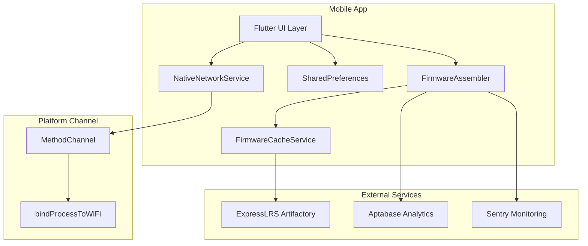
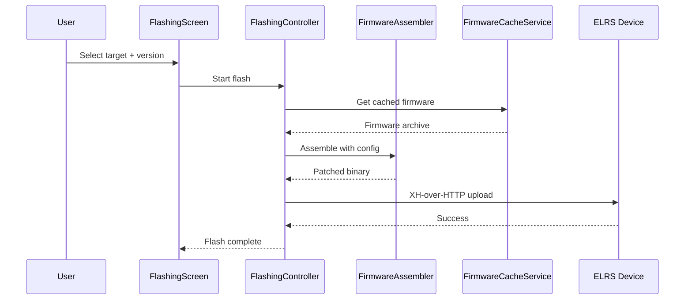
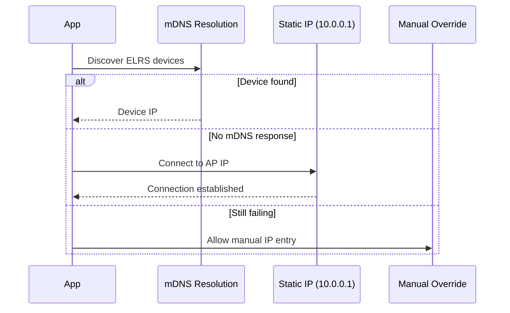

# System Architecture

**Project**: ELRS Mobile
**Architecture Pattern**: Layered + Platform Integration
**Last Updated**: 2026-03-18

## High-Level Architecture



## Component Architecture

### Flutter UI Layer
**Purpose**: Cross-platform mobile UI for firmware management and device configuration
**Location**: [`lib/src/features/`]
**Responsibilities**:
- Flashing screen with target selection and action controls
- Settings UI with master-detail tablet layout
- Firmware manager with download progress tracking

**Dependencies**:
- Internal: FlashingController, SettingsController, ConfigViewModel
- External: flutter_hooks, riverpod, go_router

### FirmwareAssembler (Business Logic Layer)
**Purpose**: Local on-device firmware assembly and patching
**Location**: [`lib/src/core/`]
**Responsibilities**:
- Extract base firmware from cached archives
- Inject user configuration (bind phrase, WiFi, PWM settings)
- Generate target-specific binary payloads

**Interface**:
```dart
Future<Uint8List> assemble(
  Target target,
  RuntimeConfig config,
  String? bindPhrase,
) async;
```

### FirmwareCacheService (Data/Cache Layer)
**Purpose**: Local caching for firmware archives enabling offline operation
**Location**: [`lib/src/core/storage/`]
**Responsibilities**:
- Pull and store firmware.zip and hardware.zip from Artifactory
- Maintain versioned cache for instant flashing
- Handle cache invalidation and cleanup

### NativeNetworkService (Platform Integration Layer)
**Purpose**: Platform channel wrapper for OS-level WiFi network binding
**Location**: [`lib/src/core/networking/native_network_service.dart`]
**Responsibilities**:
- Invoke platform channels for bindProcessToWiFi
- Prevent OS cellular fallback to 10.0.0.1
- Cross-platform abstraction (iOS stub, Android implementation)

**Interface**:
```dart
Future<void> bindProcessToWiFi();
Future<void> unbindProcess();
```

## Data Flow

### Firmware Flashing Flow


### Device Discovery Flow


## Integration Points

### External Services
- **ExpressLRS Artifactory**: Firmware repository for base firmware.zip and device-specific hardware.zip
- **Aptabase**: Privacy-first, opt-in usage analytics for feature prioritization
- **Sentry**: Real-time runtime exception and flashing pipeline failure monitoring
- **Google Analytics**: Website traffic tracking (G-8X6YE82V0S)

### Platform APIs
- **bindProcessToWiFi**: OS-level API to force app process onto Wi-Fi interface
- **MethodChannel**: Flutter-to-native bridge using `org.expresslrs.elrs_mobile/network`

## Performance Considerations

### Bottlenecks
- Initial firmware cache download (one-time, ~50MB per target)
- Device discovery timeout (mDNS can take 2-5 seconds)

### Scalability
- Firmware cache enables instant subsequent flashes
- Local assembly eliminates cloud compile latency

### Monitoring
- Flashing events tracked via AnalyticsService
- Error reporting via Sentry with device context
