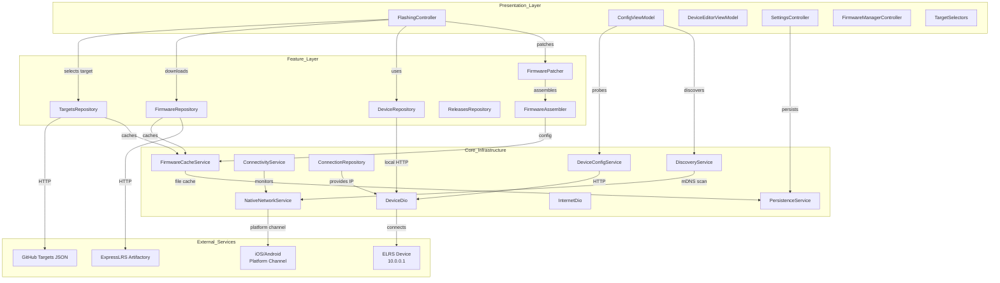
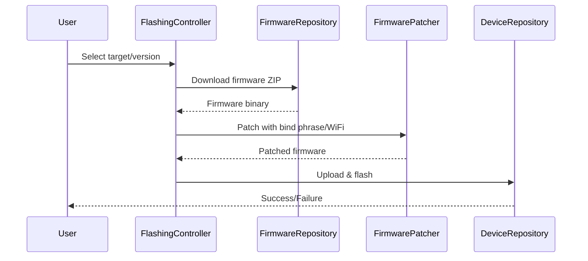
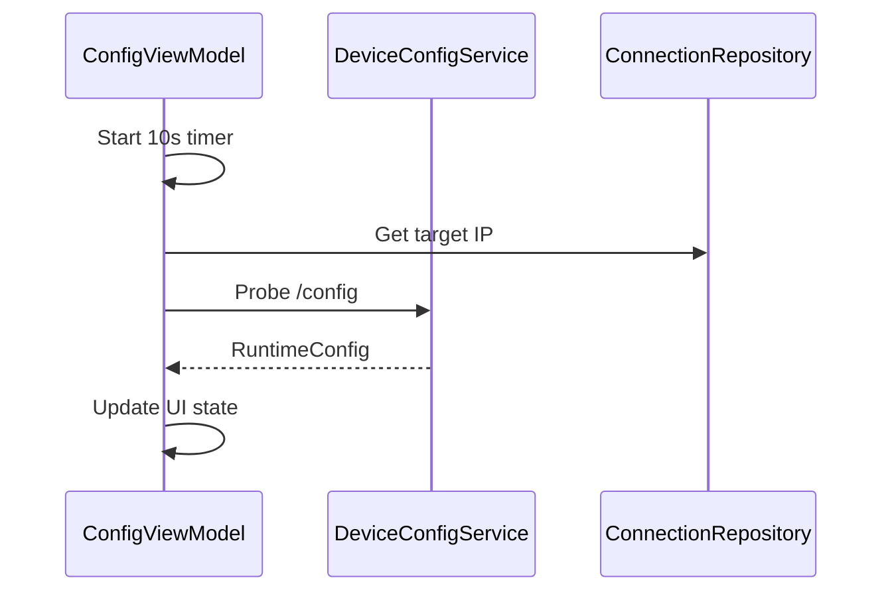
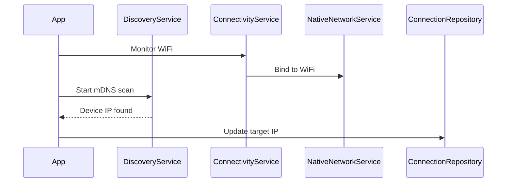

# System Architecture

**Project**: ELRS (ExpressLRS) Mobile App
**Architecture Pattern**: Clean Architecture with Riverpod State Management
**Last Updated**: 2026-03-12

## High-Level Architecture

## Component Architecture

### Flashing Module (`lib/src/features/flashing/`)
**Purpose**: Core firmware flashing functionality
**Key Components**:
- **FlashingController**: Orchestrates download → patch → flash workflow
- **FirmwarePatcher**: Binary modification for ESP/STM32
- **FirmwareAssembler**: Builds unified firmware with appended config
- **DeviceRepository**: HTTP client for device flashing (10.0.0.1)
- **FirmwareRepository**: Downloads from ExpressLRS Artifactory
- **TargetsRepository**: Fetches target definitions from GitHub

**Dependencies**:
- Internal: persistenceService, firmwareCacheService, connectivityService
- External: dio, archive, flutter_wakelock

### Configuration Module (`lib/src/features/config/`)
**Purpose**: Device runtime configuration via heartbeat
**Key Components**:
- **ConfigViewModel**: Heartbeat polling, config fetch/update
- **DeviceEditorViewModel**: Device configuration editing
- **DeviceConfigService**: HTTP client for /config, /options.json
- **RuntimeConfigModel**: Freezed model for device settings
- **FrequencyValidator**: Validates frequency against hardware

### Networking Layer (`lib/src/core/networking/`)
**Purpose**: Device discovery and connectivity
**Key Components**:
- **DiscoveryService**: mDNS scanning for `_http._tcp`
- **ConnectivityService**: Network interface binding
- **NativeNetworkService**: Platform channel for WiFi binding
- **ConnectionRepository**: Target IP management
- **DeviceDio**: Pre-configured HTTP client

### Storage Layer (`lib/src/core/storage/`)
**Purpose**: Persistence and caching
**Key Components**:
- **PersistenceService**: SharedPreferences for credentials
- **FirmwareCacheService**: File-based ZIP caching

## Data Flow

### Firmware Flash Flow

### Heartbeat Polling Flow

### Device Discovery Flow

## Integration Points

### External Services
- **ExpressLRS Artifactory**: Firmware hosting - `https://artifactory.expresslrs.org/`
- **GitHub Targets Repository**: Target definitions JSON
- **Sentry**: Error tracking via sentry_flutter

### Internal Communication
- **Riverpod Providers**: Dependency injection throughout
- **Freezed Immutable States**: State management
- **Platform Channels**: Native WiFi binding (iOS/Android)

## Security Architecture

### Authentication
- **UID-based Binding**: 6-byte unique ID from binding phrase MD5
- **No persistent auth tokens**: Each session uses device IP

### Data Protection
- **Credentials**: Stored in SharedPreferences (encrypted on mobile)
- **WiFi Binding**: Platform channels for secure network control

## Performance Considerations

### Bottlenecks
- Firmware downloads (large ZIP files)
- Binary patching on main thread (async handling)
- mDNS discovery latency

### Scalability
- Firmware caching for offline use
- Target JSON caching
- Parallel download/extract

### Monitoring
- Sentry for crash reporting
- Debug print statements in repositories

## Deployment Architecture

### Environments
- **Development**: Local builds, debug mode
- **Staging**: Beta releases via TestFlight/Play Store internal
- **Production**: GitHub Releases with semantic versioning (v*)

### Infrastructure
- **Platforms**: Android (APK/AAB), iOS (IPA), Web (experimental)
- **Distribution**: GitHub Releases
