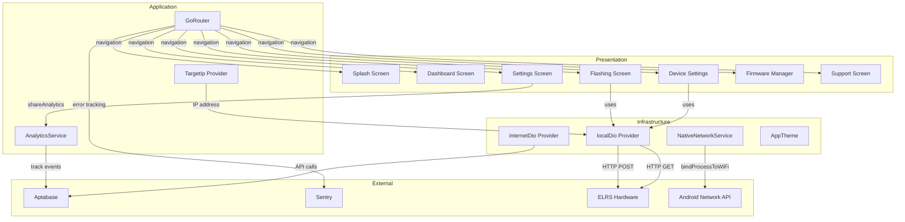
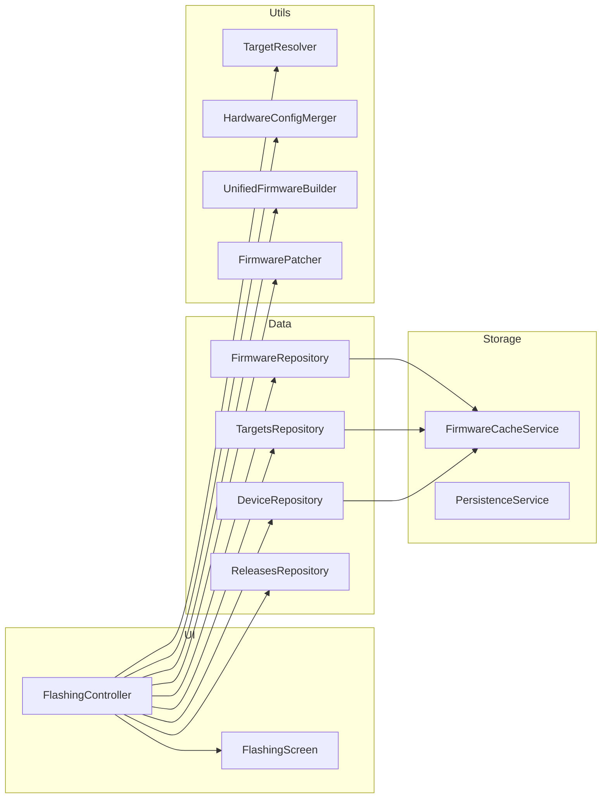
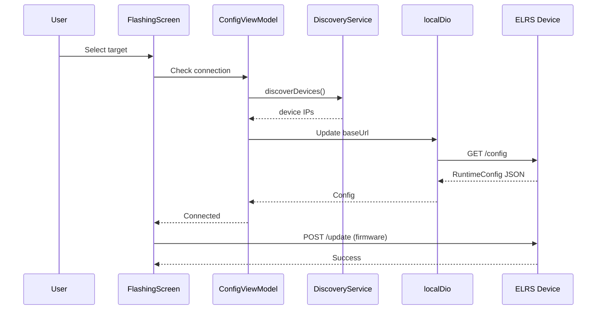
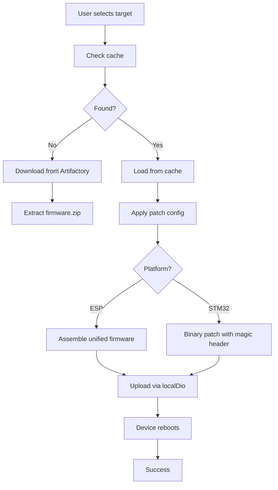

# System Architecture

**Project**: ExpressLRS Configurator
**Architecture Pattern**: Feature-First Clean Architecture with Provider-Based State Management
**Last Updated**: 2026-04-02

## High-Level Architecture

## Architecture Patterns

### Provider-Based State Management
**Evidence**: Riverpod providers in connection_repository.dart (TargetIp), device_dio.dart (localDio, internetDio), analytics_service.dart
**Description**: Riverpod used for reactive state management with code generation (@riverpod, @Riverpod annotations)

### Repository Pattern
**Evidence**: TargetIp repository manages device IP state with logging
**Description**: Centralized state container for target device connection state

### Feature-First Architecture
**Evidence**: lib/src/features/* directories with splash, flashing, settings, dashboard, configurator, firmware_manager, support
**Description**: UI organized by feature modules containing presentation logic

### Platform Channels
**Evidence**: native_network_service.dart uses MethodChannel('org.expresslrs.elrs_mobile/network') for WiFi binding
**Description**: Native Android/iOS integration for network interface binding without OS routing

### Dual-Network Strategy
**Evidence**: device_dio.dart provides localDio (WiFi target) and internetDio (external APIs)
**Description**: Separated HTTP clients for local device communication vs internet traffic

## Component Architecture

### Presentation Layer
**Purpose**: UI screens and widgets
**Components**: splash_screen.dart, dashboard_screen.dart, flashing_screen.dart, settings_screen.dart, device_settings_screen.dart, firmware_manager_screen.dart, support_screen.dart
**Dependencies**: Application Layer

### Application Layer
**Purpose**: Business logic, providers, controllers
**Components**: router.dart, analytics_service.dart, connection_repository.dart
**Dependencies**: Infrastructure Layer

### Infrastructure Layer
**Purpose**: External integrations, networking, platform access
**Components**: device_dio.dart, native_network_service.dart, app_theme.dart
**Dependencies**: None (boundary to external)

### Domain/Data Layer
**Purpose**: Device configurations and hardware definitions
**Components**: targets.json, runtime_config_model.dart
**Dependencies**: None (data source)

### Flashing Feature Architecture

## Data Flow

### Device Connection Flow

### Firmware Flashing Pipeline

## Integration Points

### External Services

| Service | Purpose | Integration Type | Details |
|---------|---------|------------------|---------|
| Aptabase Analytics | User event and analytics tracking | REST API | Aptabase Flutter SDK with app ID A-US-0489684056, configurable via user opt-in |
| Sentry | Error tracking and crash reporting | Flutter SDK | SentryNavigatorObserver integrated with GoRouter for automatic screen tracking |
| ELRS Device WebUI | Device configuration and firmware upload | HTTP REST | localDio connects to 10.0.0.1 on ELRS devices, internetDio fetches from release servers |
| Artifactory | Firmware artifact storage | HTTP | Downloads firmware.zip and hardware.zip from ELRS builds |
| GitHub | Target definitions | HTTP | Fetches targets.json from ExpressLRS/targets repository |

### Platform Channels

| Channel | Platform | Purpose | Methods |
|---------|---------|---------|---------|
| org.expresslrs.elrs_mobile/network | Android | Bind process to WiFi | bindProcessToWiFi(), unbindProcess() |
| org.expresslrs.elrs_mobile/network | iOS | No-op | N/A |

## Network Architecture

### Dual Dio Strategy

| Client | Purpose | Base URL | Timeout |
|--------|---------|----------|---------|
| localDio | Device communication | 10.0.0.1 (AP mode) or discovered IP | 10s connect, 30s receive |
| internetDio | External APIs | aptabase.app, github.com | 60s default |

### Connectivity Binding
- **Problem**: Android routes traffic based on internet availability, not WiFi association
- **Solution**: Platform channel binds process to WiFi interface via NetworkApi
- **Flow**: 
  1. User connects to ELRS device hotspot
  2. App calls `nativeNetworkService.bindProcessToWiFi()`
  3. Android API forces all HTTP traffic through WiFi even without internet
  4. After flashing, `unbindProcess()` restores normal routing

## Deployment Architecture

### Mobile Platforms
- **Android**: Native network binding via platform channel
- **iOS**: Automatic WiFi routing (no binding needed)

### Distribution
- Google Play Store (Android)
- Apple App Store (iOS)

### Build Variants
- Debug: Full logging, mock services available
- Release: Proguard/R8 minification, crash reporting enabled
