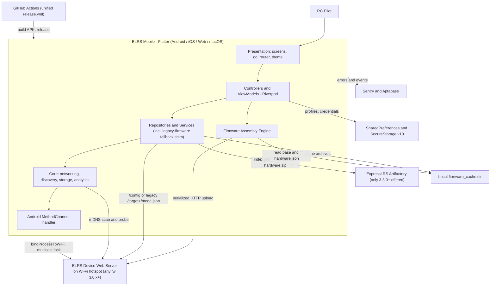

# System Architecture

**Project**: ELRS Mobile
**Architecture Pattern**: Feature-first layered (clean-architecture slices) + Riverpod reactive DI
**Last Updated**: 2026-09-22

## High-Level Architecture

```mermaid
graph TB
    User["RC Pilot"]
    subgraph App["ELRS Mobile - Flutter (Android / iOS / Web / macOS)"]
        UI["Presentation: screens, go_router, theme"]
        Ctrl["Controllers and ViewModels - Riverpod"]
        Repo["Repositories and Services (incl. legacy-firmware fallback shim)"]
        Assembler["Firmware Assembly Engine"]
        Core["Core: networking, discovery, storage, analytics"]
        Native["Android MethodChannel handler"]
    end
    Artifactory["ExpressLRS Artifactory (only 3.3.0+ offered)"]
    Device["ELRS Device Web Server on Wi-Fi hotspot (any fw 3.0.x+)"]
    Cache["Local firmware_cache dir"]
    Prefs["SharedPreferences and SecureStorage v10"]
    Telemetry["Sentry and Aptabase"]
    CI["GitHub Actions (unified release.yml)"]

    User --> UI --> Ctrl --> Repo
    Ctrl --> Assembler
    Repo --> Core
    Core --> Native
    Repo -->|index.json, firmware.zip, hardware.zip| Artifactory
    Repo -->|cache archives| Cache
    Assembler -->|read base and hardware.json| Cache
    Assembler -->|serialized HTTP upload| Device
    Repo -->|/config or legacy /target+/mode.json| Device
    Core -->|mDNS scan and probe| Device
    Native -->|bindProcessToWiFi, multicast lock| Device
    Ctrl -->|profiles, credentials| Prefs
    App -.errors and events.-> Telemetry
    CI -->|build APK, release| App
```

## Layers

| Layer | Purpose | Representative components |
|-------|---------|---------------------------|
| Presentation | Screens, widgets, routing, theming, responsive layout | `lib/src/features/*/presentation/*`, `lib/src/router.dart`, `lib/src/core/theme/app_theme.dart`, `lib/src/core/presentation/responsive_layout.dart`, `lib/src/app.dart` |
| Application / State | Controllers and view models orchestrating use cases and holding UI state | `flashing_controller.dart`, `flashing/state/flashing_provider.dart`, `flashing/application/firmware_patcher.dart`, `config/presentation/*_view_model.dart`, `settings_controller.dart` |
| Data | Repositories / providers for remote (Artifactory / device) and local data, including legacy-firmware compatibility fallbacks | `flashing/data/*`, `config/services/device_config_service.dart`, `core/networking/connection_repository.dart` |
| Domain | Immutable Freezed models and business rules | `flashing/domain/*`, `config/domain/*` |
| Firmware Assembly Engine | On-device ESP/STM32 binary trimming, config byte-packing, gzip | `firmware_assembler.dart`, `stm32_firmware_patcher.dart`, `hardware_config_merger.dart`, `target_resolver.dart` |
| Core / Cross-cutting | Networking, discovery, connectivity, storage, analytics, logging, utils | `core/networking/*` (incl. `expected_reboot_drop.dart`), `core/storage/*`, `core/analytics/*`, `core/utils/*` |
| Native Platform | Android Kotlin for Wi-Fi process binding and multicast locks (iOS no-op; macOS relies on Flutter plugins directly, no custom channel) | `android/app/src/main/kotlin/.../MainActivity.kt` |

Dependency direction is Presentation -> Application -> Data / Domain / Core. One deliberate **inversion smell** persists: `core/networking/discovery_service.dart` reads `features/flashing/state` (`isFlashingProvider`) so background scanning pauses during a flash — core depends on a feature.

## Architectural Patterns

- **Feature-first modular layered architecture** — each feature is a self-contained vertical slice (`domain`, `data`, `application`/`state`, `presentation`); cross-cutting code lives in `core/`. `flashing` is the fullest slice; others (`configurator`, `splash`, `support`) are thin. The `updates` feature (legacy in-app self-update check) was removed entirely — the app relies solely on store-based distribution now.
- **Riverpod provider-based DI + reactive state** — `@riverpod` / `@Riverpod(keepAlive: true)` codegen (`*.g.dart`); `ProviderContainer` created in `main.dart`, `UncontrolledProviderScope` wraps `App`. `keepAlive` for app-lifetime singletons (discovery, analytics, target IP, `isFlashing`).
- **Local-first / offline-first pipeline** — firmware assembly and config editing happen entirely on-device so field use needs no internet after an initial cache download.
- **Platform-channel bridging** — `MethodChannel('org.expresslrs.elrs_mobile/network')` forces the app process onto the non-internet ELRS hotspot and manages multicast locks for mDNS (Android only).
- **Repository pattern for external data** — network/device access hidden behind repositories/services returning domain models.
- **Client-side request serialization (bulkhead)** — `SequentialRequestInterceptor` in `device_dio.dart` forces one-at-a-time requests to the device to protect fragile ESP8285 web servers.
- **Code-generation build pipeline** — `build_runner` with `freezed`, `json_serializable`, `riverpod_generator`; `flutter gen-l10n` + `arb_translate` for localization.
- **Firmware-version compatibility shim (backward-compat adapter)** — `DeviceConfigService.probeDeviceHead` falls back to `probeDevice('/')` when `/hardware.json` 404s, and `fetchConfig` falls back to a new `_fetchLegacyConfig()` reconstructing `RuntimeConfig` from `/target` + best-effort `/mode.json` for firmware older than 3.1.0. Meanwhile `ReleasesRepository` now only offers versions >= 3.3.0 for download/flashing. Net effect: the app can *configure* older already-flashed devices (down to ~3.0.x) but will only *flash* unified firmware (3.3.0+) — a deliberate widening between the "configurable" and "flashable" firmware ranges. `DeviceConfigService` is now read/probe-only in this area — `saveOptions`/`saveConfig`/`reboot` were removed as dead code (their only caller, `ConfigViewModel`, had already been trimmed of its own unwired write methods); config writes are no longer handled here.
- **Shared predicate extraction (DRY refactor of a diverged duplicate)** — `core/networking/expected_reboot_drop.dart` exports `isExpectedRebootSocketDrop(DioException)`, now the sole implementation of the expected-error-as-success check for post-reboot socket drops, replacing two independently-maintained copies that had drifted apart (one omitted `ECONNREFUSED`, causing some successful flashes to be misreported as failures). Only `DeviceRepository` calls it now.

## Key Data Flows

### App startup (asynchronous bootstrap)
`main()` sets up `Logger` (piped to Sentry breadcrumbs) -> `SentryWidgetsFlutterBinding.ensureInitialized()` -> `ProviderContainer` created -> `analyticsService.init()` (Aptabase, fire-and-forget) -> `runApp(UncontrolledProviderScope -> App -> MaterialApp.router)` -> `Sentry.init()` after first frame when `SENTRY_DSN` is defined -> post-frame: `connectivityService.autoBindIfWiFi()` then `settingsController.loadSettings()`.

### Device discovery and connection (event-driven / streaming)
`connectivityService` detects Wi-Fi -> `discoveryServiceProvider` (keepAlive, in `discovery_service.dart`; the redundant, never-watched `discovery_provider.dart` was deleted) restarts/stops an mDNS scan (`nsd`), skipping while `isFlashingProvider` is true -> `NativeNetworkService.acquireMulticastLock` + `bindProcessToWiFi` (Android) -> discovered IP written to `TargetIp` -> `localDio` rebuilds with the device base URL -> `DeviceConfigService.probeDevice` polls `http://<ip>/`.

### Firmware download and caching (request/response + persistence)
Firmware Manager requests a release -> `releases_repository` / `firmware_repository` GET `https://artifactory.expresslrs.org/ExpressLRS/index.json` (client-side filtered to versions >= 3.3.0, since only unified firmware is offered for flashing) -> `firmware.zip` and `hardware.zip` downloaded via Dio -> `FirmwareCacheService` saves archives + targets JSON under `<AppDocuments>/firmware_cache/<version>/` -> `evictOldestVersions` enforces the max-cached limit. A version is listed only when **both** zips are present.

### Firmware assembly and flashing (synchronous pipeline)
User selects target/version/options; `flashing_controller` builds a `PatchConfiguration` -> `FirmwareAssembler` extracts the base binary from the cached `firmware.zip`, trims to the ESP `0xE9` magic -> fixed-width blocks appended to the binary tail: product name (128 B), lua name (16 B), options JSON (512 B), hardware layout JSON (2048 B); regulatory domain (FCC / EU868 / LBT) injected -> payload gzipped when the target requires it (e.g. `esp8285`) -> POSTed to the device over the serialized `localDio`. STM32 targets instead get 6-byte UID + `Uint8` domain bit-packed via `Stm32FirmwarePatcher` and have no OTA path. On a target-mismatch force-flash, the controller now calls `confirmForceUpdate()` directly first (trusting that the mismatched bytes are still sitting in the device's OTA write buffer from the initial `/update` attempt, the same assumption the ExpressLRS WebUI makes), and only falls back to a full re-upload-then-confirm if the direct confirm fails.

### Device configuration reading (request/response, with legacy-firmware fallback)
`config_view_model` loads `RuntimeConfig` from the device via `DeviceConfigService.fetchConfig` -> on success, `_normalizeV3Config` / `_normalizeConfigDomains` normalize V3 payloads into the V4 shape (`reg_domain` -> `domain`, hoisted `settings` node, `vbind` coercion) before Freezed deserialization -> on a 404 (firmware older than 3.1.0, which predates `/config`), falls back to `_fetchLegacyConfig`, reconstructing an equivalent `RuntimeConfig` from `/target` (present through at least 3.2.1) plus best-effort `/mode.json`, populating `effectiveProductName` so the Target Mismatch Guard compares against real device data instead of leaving the device stuck "disconnected". Similarly, `probeDeviceHead` falls back to the universal `probeDevice('/')` when `/hardware.json` (unified-target firmware only, 3.2.x+) 404s. **Writing** device settings no longer has a native code path: `device_editor_view_model.dart` (which used to mutate settings and POST them back via `DeviceConfigService.saveOptions`/`saveConfig`/`reboot`) was deleted as dead code along with those three `DeviceConfigService` methods — device configuration is now edited exclusively through the embedded device WebUI (`features/configurator`). `FrequencyValidator` and `PersistenceService` (binding phrase / Wi-Fi credentials) remain relevant to the flashing write-path, not this one.

## Integration Points

| Service | Purpose | Type |
|---------|---------|------|
| ExpressLRS Artifactory (`artifactory.expresslrs.org`) | Firmware index, generic `firmware.zip`, `hardware.zip`; index filtered to versions >= 3.3.0 (unified firmware only) | HTTPS REST (Dio) |
| ExpressLRS `targets.json` (GitHub raw) | Flashable target definitions; also cached and bundled as `assets/targets.json` | HTTPS GET |
| ELRS device web server (e.g. `10.0.0.1`, `elrs_rx.local`) | Read/write `hardware.json` / `/config` (or legacy `/target`, `/mode.json` on pre-3.1.0 firmware) and runtime config, upload firmware, reboot | Local HTTP (serialized Dio) |
| mDNS / DNS-SD (`nsd`) | Zero-config discovery of ELRS devices | Native service discovery |
| Android platform channel | Force Wi-Fi process binding + multicast lock | Flutter `MethodChannel` |
| Sentry | Opt-in crash/error reporting + log breadcrumbs; benign socket errors filtered, 50% sample rate; DSN via `--dart-define SENTRY_DSN` | `sentry_flutter` SDK |
| Aptabase | Privacy-friendly product analytics, opt-in via settings | `aptabase_flutter` SDK |
| Google Gemini (build-time) | Automated ARB translation via `arb_translate` | CI tooling |
| GitHub Actions | APK build + release (single unified workflow, tag/dispatch-triggered), website deploy, ARB translation, upstream `targets.json` sync | CI/CD |

## Security & Data Protection

- **Secret storage**: `FlutterSecureStorage` (now `^10.3.4`, up from `^9.x` — cipher migration per commit e2401d5) for binding phrases, Wi-Fi credentials, and the JSON-encoded flashing-profile list; on Android backed by `AndroidOptions()` (v10 defaults, replacing the previous explicit `encryptedSharedPreferences: true` flag). `SharedPreferences` holds only non-sensitive prefs (manual IP, disclaimer acceptance, locale, migration flag). `PersistenceService.migrateIfNeeded()` performs a one-time plaintext -> secure migration tracked by `security_migration_v1_done`.
- **No auth**: the app has no accounts or backend; device access is unauthenticated local HTTP on an isolated AP.
- **Transport**: HTTPS to Artifactory/GitHub; plain HTTP to the device (the device serves no TLS).
- **Regulatory safety**: `FrequencyValidator` rejects a 2.4 GHz-capable model reporting a sub-GHz frequency (checks bit 7 of `config.modelId`), guarding against flashing an illegal frequency plan.

## Performance Considerations

- Large `targets.json` parsing is offloaded to an isolate via `compute(_parseTargets, ...)` to keep the UI responsive.
- Device probes use short (~2 s) `sendTimeout` / `receiveTimeout`; `CancelToken`s thread through device calls.
- All device HTTP is serialized (one connection at a time) — intentional throughput cap to keep the ESP8285 stable.
- `wakelock_plus` holds the screen awake during flashing; orientation locked to portrait to prevent Riverpod `autoDispose` teardown mid-flash.

## Deployment Architecture

- **Type**: Cross-platform Flutter mobile app, with a maintained macOS desktop target. Flutter SDK `^3.11.0` / Dart. `pixi.toml` pins tooling env.
- **Platforms**: Android (primary — native Wi-Fi binding), iOS (native channel calls are no-ops), Web (partial, `kIsWeb` guards), macOS (Flutter plugin set mirrors mobile: `connectivity_plus`, `device_info_plus`, `file_picker`, `flutter_secure_storage_darwin`, `nsd_macos`, `sentry_flutter`, `wakelock_plus`, `webview_flutter_wkwebview`).
- **Version**: semantic version in `pubspec.yaml` (`1.0.44-rc1+46`).
- **Distribution**: Google Play + Apple App Store; GitHub Releases APK built by a single, unified `.github/workflows/release.yml` triggered on `v*` tags and `workflow_dispatch` (with `custom_version`/`custom_build_number`/`play_store_track` inputs) — the separate development-branch push trigger and standalone RC workflow were consolidated into this one.
- **Build config**: Sentry DSN injected via `--dart-define`; `flutter_launcher_icons` (iOS launch image now uses the branded logo, replacing a placeholder); assets bundle `docs/`, `assets/lua/`, `assets/targets.json`. Android build tooling upgraded to Gradle `9.3.1` with the modern `kotlin { compilerOptions { jvmTarget } }` DSL (migrated off deprecated `kotlinOptions`).
- **Companion**: marketing/docs website (`website/`, Astro + Starlight) deployed via `deploy-website.yml`.
- **Dev tooling**: an `opencode.json` at repo root grants the OpenCode agent harness read/write access to `~/.rp1/**`, indicating this project's rp1 knowledge base is shared across multiple agent-harness tools (Claude Code and OpenCode), not just one.

## Related KB Links

- Component inventory: [modules.md](modules.md)
- Domain terminology: [concept_map.md](concept_map.md)
- Interaction semantics: [interaction-model.md](interaction-model.md)
- Code conventions: [patterns.md](patterns.md)
