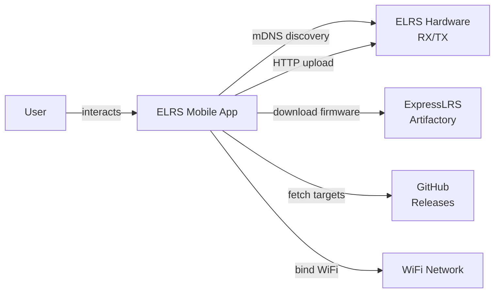
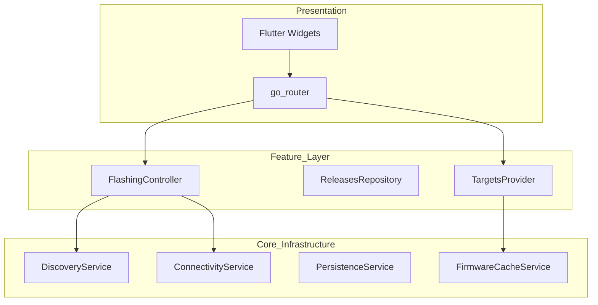
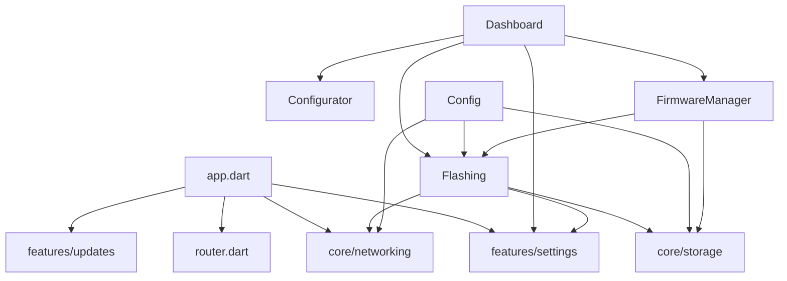
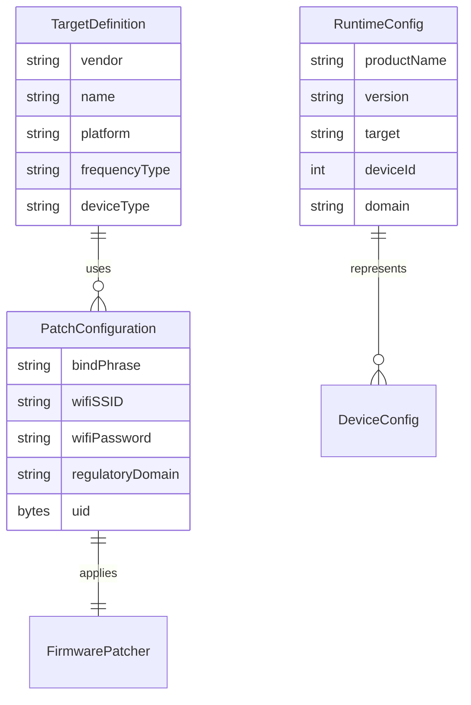
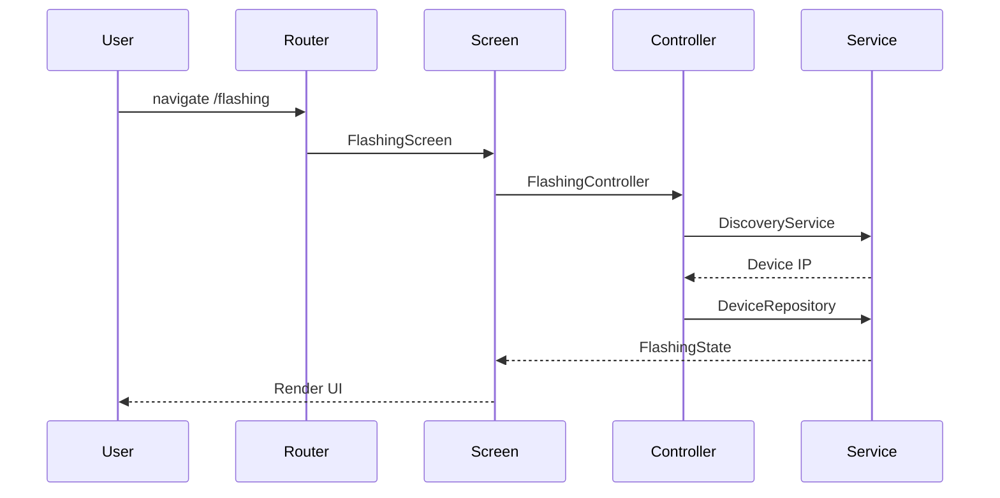
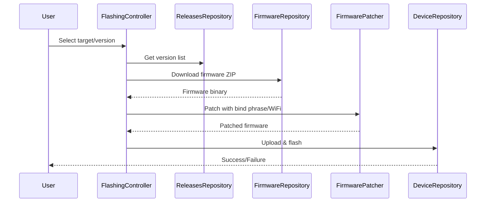
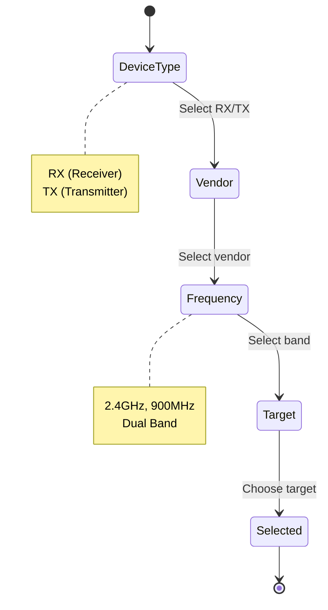
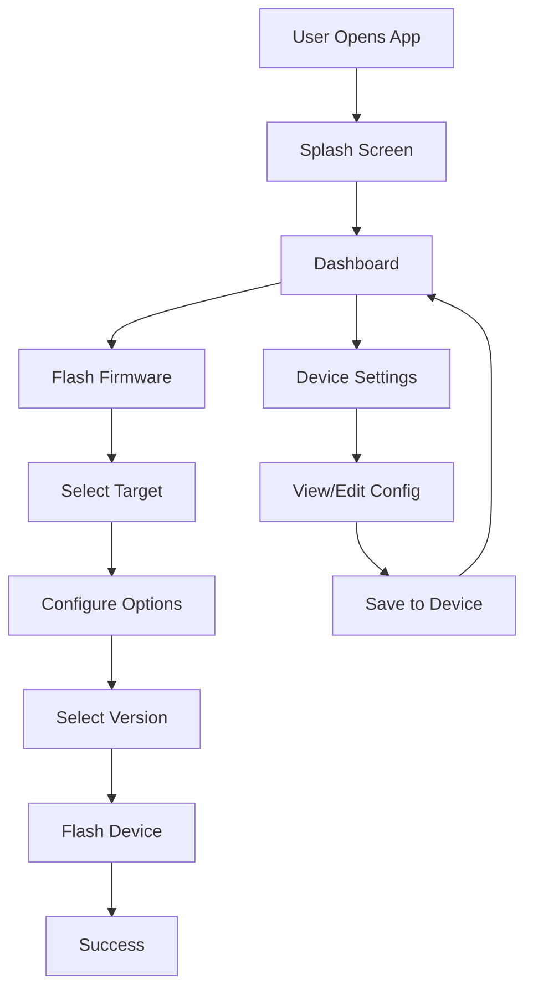
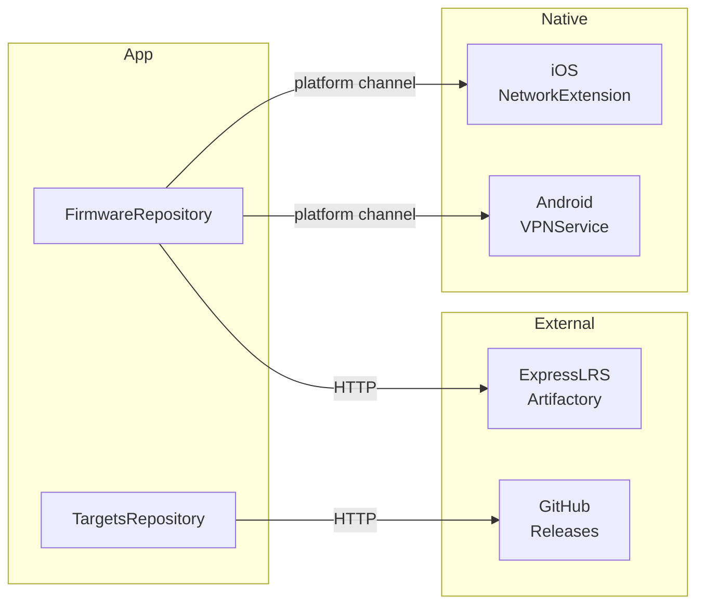

# ELRS (ExpressLRS) Mobile App — Bird's-Eye View

## 1) Summary

ELRS (ExpressLRS) Mobile App is a Flutter application for flashing ExpressLRS firmware to RC model receivers and transmitters. Users select hardware targets, download firmware, patch binaries with custom configuration (binding phrase, WiFi credentials), and flash devices over WiFi.

- **Domain**: RC Model Firmware Management • **Tech Stack**: Flutter, Dart, Riverpod, go_router, freezed, dio
- **Architecture**: Clean Architecture with Riverpod State Management

## 2) System Context

The app interacts with ELRS hardware devices on the local network, downloads firmware from external services, and stores user configuration locally. It discovers devices via mDNS and binds to WiFi to maintain connectivity during flashing.

## 3) Architecture Overview (components & layers)

The app follows Clean Architecture with three layers: Presentation (Flutter widgets + go_router), Feature Layer (Riverpod providers + controllers), and Core Infrastructure (networking, storage, discovery).

## 4) Module & Package Relationships

The codebase is organized into `core/` (shared infrastructure) and `features/` (domain-specific modules). The flashing module is the most complex, depending on storage, networking, and settings features.

## 5) Data Model (key entities)

The domain centers on TargetDefinition (hardware targets), PatchConfiguration (firmware patching settings), and RuntimeConfig (device runtime state). These entities drive the flashing workflow.

## 6) API Surface (public endpoints → owning components)

The app exposes 6 main routes: `/` (splash), `/dashboard` (main hub), `/flashing` (firmware flashing), `/settings` (app config), `/device_config` (device runtime), `/firmware_manager` (cache). Device communication uses HTTP at 10.0.0.1.

- `GET /` → SplashScreen → SplashController
- `GET /dashboard` → DashboardScreen → HardwareStatusCard
- `GET /flashing` → FlashingScreen → FlashingController
- `GET /settings` → SettingsScreen → SettingsController
- `GET /device_config` → DeviceSettingsScreen → ConfigViewModel
- `GET /firmware_manager` → FirmwareManagerScreen → FirmwareManagerController

## 7) End-to-End Data Flow (hot path)

The primary user flow is firmware flashing: user selects target → app downloads firmware ZIP → patches binary with bind phrase/WiFi → uploads to device via HTTP → device flashes itself.

## 8) State Model (critical domain entity)

TargetDefinition represents hardware devices and has cascading selection: device type → vendor → frequency → specific target. The selection drives firmware compatibility.

## 9) User Flows (top 1-2 tasks)

The two primary user flows are firmware flashing (core value) and device configuration. Flashing involves target selection → options configuration → version selection → flash execution.

## 10) Key Components & Responsibilities

- `features/flashing/` — End-to-end firmware flashing (download, patch, flash)
- `features/config/` — Device runtime configuration via heartbeat
- `core/networking/` — Device discovery (mDNS) and WiFi binding
- `core/storage/` — Persistence (SharedPreferences) and firmware caching
- `features/settings/` — Global app settings (binding phrase, WiFi credentials)

## 11) Integrations & External Systems

The app integrates with ExpressLRS Artifactory for firmware binaries, GitHub Releases for version metadata and targets.json, and uses platform channels for native WiFi binding on iOS/Android.

## 12) Assumptions & Gaps

- TBD: Test coverage details for config/settings features (limited in KB)
- Next reads: `lib/src/features/flashing/data/device_repository.dart` for device HTTP protocol details
- Risks to verify: mDNS discovery reliability on different Android versions, WiFi binding edge cases

