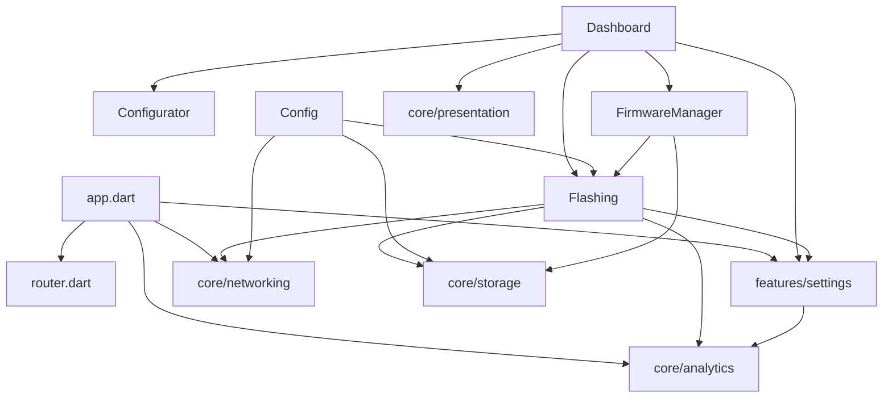

# Module & Component Breakdown

**Project**: ELRS (ExpressLRS) Mobile App
**Analysis Date**: 2026-03-15
**Modules Analyzed**: 12

## Core Modules

### core/analytics (`lib/src/core/analytics/`)
**Purpose**: Analytics and crash reporting service - Aptabase integration with opt-in usage tracking
**Complexity**: Low
**Dependencies**: aptabase_flutter, riverpod_annotation

**Key Components**:
- **AnalyticsService** (`analytics_service.dart`): Event tracking with trackEvent(name, properties), respects shareAnalytics setting

### core/theme (`lib/src/core/theme/`)
**Purpose**: App-wide Material 3 theming with ELRS brand colors
**Complexity**: Low
**Dependencies**: flutter

**Key Components**:
- **AppTheme** (`app_theme.dart`): Material 3 dark theme configuration

### core/presentation (`lib/src/core/presentation/`)
**Purpose**: Shared presentation utilities - responsive breakpoint helpers
**Complexity**: Low
**Dependencies**: flutter

**Key Components**:
- **ResponsiveLayout**: Breakpoint constants and max-width constraint widget

### core/storage (`lib/src/core/storage/`)
**Purpose**: Persistence layer - SharedPreferences for settings and file-based firmware caching
**Complexity**: Low
**Dependencies**: shared_preferences, path_provider, archive

**Key Components**:
- **PersistenceService**: Bind phrase, WiFi credentials, manual IP storage
- **FirmwareCacheService**: Firmware ZIP file caching, cache size management

### core/networking (`lib/src/core/networking/`)
**Purpose**: Device discovery, connectivity management, HTTP client for ELRS device communication
**Complexity**: Medium
**Dependencies**: dio, connectivity_plus, dns_client

**Key Components**:
- **DiscoveryService**: mDNS/bonjour scanning for `_http._tcp` with analytics
- **ConnectivityService**: Network interface binding for WiFi control
- **NativeNetworkService**: Platform channel for WiFi binding
- **DeviceDio**: Pre-configured HTTP client

## Feature Modules

### features/flashing (`lib/src/features/flashing/`)
**Purpose**: Core firmware flashing functionality - target selection, firmware download, patching, and device flashing
**Complexity**: High
**Dependencies**: core/storage, core/networking, core/analytics, features/settings

**Key Components**:
- **FlashingController**: End-to-end flashing orchestration with analytics
- **FirmwarePatcher**: Binary firmware modification
- **DeviceRepository**: Device flashing via HTTP with analytics events

### features/dashboard (`lib/src/features/dashboard/`)
**Purpose**: Main entry screen - displays device connection status and navigation
**Complexity**: Low
**Dependencies**: features/settings, flutter_svg, core/presentation

**Key Components**:
- **DashboardScreen**: Main hub with navigation cards

### features/settings (`lib/src/features/settings/`)
**Purpose**: App configuration - binding phrases, WiFi credentials, developer mode, analytics opt-in
**Complexity**: Medium
**Dependencies**: core/storage, core/presentation, core/analytics

**Key Components**:
- **SettingsController**: Global app settings management with shareAnalytics
- **SettingsScreen**: Settings UI with master-detail on tablet

### features/config (`lib/src/features/config/`)
**Purpose**: Device runtime configuration - heartbeat monitoring, options management
**Complexity**: Medium
**Dependencies**: core/networking, core/storage, features/flashing

**Key Components**:
- **ConfigViewModel**: Heartbeat polling, config fetch/update
- **DeviceConfigService**: HTTP client for device config

### features/configurator (`lib/src/features/configurator/`)
**Purpose**: Device settings UI screen via embedded WebView
**Complexity**: Low

**Key Components**:
- **DeviceSettingsScreen**: WebView for ELRS device configuration

### features/firmware_manager (`lib/src/features/firmware_manager/`)
**Purpose**: Offline firmware cache management
**Complexity**: Low
**Dependencies**: core/storage, features/flashing

### features/updates (`lib/src/features/updates/`)
**Purpose**: App update checking functionality (legacy - now returns early)
**Complexity**: Low

## Module Dependencies

### Dependency Graph

### Import Analysis
- **Most Imported**: core/networking (used by flashing, config)
- **Most Dependencies**: features/flashing (complex with analytics)
- **Circular Dependencies**: None detected

## Module Metrics

| Module | Files | Lines | Complexity |
|--------|-------|-------|------------|
| features/flashing | 20 | 3,500 | High |
| core/networking | 6 | 400 | Medium |
| core/analytics | 2 | 56 | Low |
| core/storage | 2 | 249 | Low |
| core/presentation | 1 | 43 | Low |
| features/settings | 7 | 1,200 | Medium |
| features/config | 5 | 600 | Medium |
| features/dashboard | 5 | 400 | Low |

## Code Quality Insights

### Well-Structured Modules
- **features/flashing**: Clear separation (data/domain/application/presentation)
- **core/analytics**: Simple, focused responsibility with proper opt-in
- **core/storage**: Simple, focused responsibility

### Areas for Improvement
- **Test coverage**: Limited in non-flashing features
- **Error handling**: Could benefit from custom exception types

### Architectural Patterns
- **Clean Architecture**: Layered separation (core infrastructure vs features)
- **Riverpod State Management**: Code-generated providers
- **Freezed Immutable States**: Immutable state classes with copyWith
- **Analytics Integration**: Service-based event tracking with user consent
