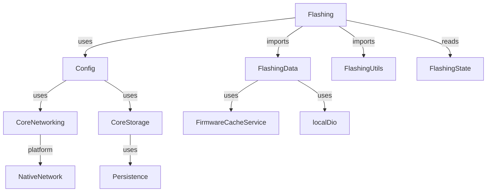

# Module & Component Breakdown

**Project**: ExpressLRS Configurator
**Analysis Date**: 2026-04-02
**Modules Analyzed**: 6

## Core Modules

### features/flashing (`lib/src/features/flashing/`)
**Purpose**: Firmware downloading, patching, building, and flashing for ELRS devices
**Complexity**: High
**Dependencies**: FirmwareRepository, DeviceRepository, TargetsRepository, ReleasesRepository, TargetResolver, HardwareConfigMerger, UnifiedFirmwareBuilder, FirmwarePatcher

**Key Components**:

| Component | Type | File | Responsibility |
|-----------|------|------|----------------|
| FlashingController | Controller | presentation/flashing_controller.dart | Main orchestrator for firmware download, patching, and flash operations |
| FlashingScreen | Screen | presentation/flashing_screen.dart | Main UI screen for firmware flashing workflow |
| FlashingState | State | state/flashing_provider.dart | Controls heartbeat silencing during firmware upload |
| FirmwareRepository | Repository | data/firmware_repository.dart | Handles firmware downloads and extraction from Artifactory |
| DeviceRepository | Repository | data/device_repository.dart | HTTP communication with ELRS devices |
| TargetsRepository | Repository | data/targets_repository.dart | Fetches and parses ELRS target definitions |
| ReleasesRepository | Repository | data/releases_repository.dart | Fetches available firmware versions |
| TargetResolver | Utility | utils/target_resolver.dart | Resolves hardware layout from hardware.zip |
| HardwareConfigMerger | Utility | utils/hardware_config_merger.dart | Merges overlay config into base hardware layout |
| UnifiedFirmwareBuilder | Utility | utils/unified_firmware_builder.dart | Builds unified ESP firmware binary |
| FirmwarePatcher | Service | application/firmware_patcher.dart | Platform-specific firmware patching orchestrator |

**Public Interface**:
```dart
// Controller actions
final controller = ref.read(flashingControllerProvider.notifier);
await controller.flash(target: target, version: version);
await controller.downloadFirmware(target: target, version: version);

// State observation
final state = ref.watch(flashingControllerProvider);
if (state.status == FlashingStatus.success) { ... }
```

**Flashing Workflow**:
```dart
// 1. Select target and version
await controller.selectTarget(targetDefinition);
await controller.selectVersion('3.6.3');

// 2. Configure (bind phrase, WiFi)
controller.updateBindPhrase('my drone');
controller.updateWifiCredentials('myssid', 'mypassword');

// 3. Flash
await controller.flash();

// State transitions: idle -> downloading -> patching -> uploading -> success/error
```

### features/config (`lib/src/features/config/`)
**Purpose**: Device connection management and runtime config synchronization
**Complexity**: Medium
**Dependencies**: DeviceConfigService, DiscoveryService, PersistenceService, ConnectivityService

**Key Components**:

| Component | Type | File | Responsibility |
|-----------|------|------|----------------|
| ConfigViewModel | ViewModel | presentation/config_view_model.dart | Manages device discovery, heartbeat, and config fetching |
| RuntimeConfigModel | Model | domain/runtime_config_model.dart | Root device configuration with settings, options, config |
| DeviceConfigService | Service | services/device_config_service.dart | HTTP client for device WebUI communication |

**Public Interface**:
```dart
// Connection state
final config = ref.watch(configViewModelProvider);
if (config != null) { ... }

// Actions
await ref.read(configViewModelProvider.notifier).saveConfig(config);
```

### features/dashboard (`lib/src/features/dashboard/`)
**Purpose**: Main entry screen with device status overview
**Components**: DashboardScreen, DashboardCard, HardwareStatusCard, ConnectionStatusBadge

### features/settings (`lib/src/features/settings/`)
**Purpose**: App settings including analytics opt-in, legal notices
**Components**: SettingsScreen, SettingsController, LegalNoticeScreen, DisclaimerDialog

### features/firmware_manager (`lib/src/features/firmware_manager/`)
**Purpose**: Local firmware file management and import
**Components**: FirmwareManagerScreen, FirmwareManagerController

### features/support (`lib/src/features/support/`)
**Purpose**: Help documentation and troubleshooting
**Components**: SupportScreen

## Support Modules

### core/networking (`lib/src/core/networking/`)
**Purpose**: Network connectivity and HTTP client management

**Services**:
- **DeviceDio**: Dual Dio instances (localDio for device, internetDio for APIs)
- **NativeNetworkService**: Platform channel for Android WiFi binding
- **DiscoveryService**: mDNS service discovery for ELRS devices
- **ConnectivityService**: Native WiFi interface binding

**Configuration**:
```dart
// localDio: 10s connect, 30s receive timeout
// internetDio: 60s default timeout
// Both use JSON response parsing
```

### core/storage (`lib/src/core/storage/`)
**Purpose**: Local storage and caching

**Services**:
- **FirmwareCacheService**: LRU cache for downloaded firmware zips
- **PersistenceService**: Encrypted storage for credentials (bind phrase, WiFi)

### core/utils (`lib/src/core/utils/`)
**Shared Functions**:
- **LuaExportUtils**: Lua script generation for device export
- **ValidationUtils**: Input validation for bind phrases, frequencies
- **BindingPhraseUtils**: MD5 hash generation for UID derivation

### core/analytics (`lib/src/core/analytics/`)
**Purpose**: Analytics tracking via Aptabase
**Configuration**: App ID A-US-0489684056, user opt-in required

## Module Dependencies



### Dependency Analysis

| Module | Internal Dependencies | External Dependencies |
|--------|----------------------|---------------------|
| features/flashing/presentation | 5 | 8 (riverpod, dio, freezed, etc.) |
| features/flashing/data | 3 | 2 (dio, archive) |
| features/flashing/utils | 1 | 1 (archive) |
| features/config | 4 | 1 (riverpod) |

## Module Metrics

| Module | Files | Lines | Components | Complexity |
|--------|-------|-------|------------|------------|
| features/flashing/presentation | 6 | ~841 | 2 | High |
| features/flashing/data | 5 | ~579 | 5 | Medium |
| features/flashing/utils | 4 | ~201 | 4 | Medium |
| features/config | 2 | ~223 | 2 | Medium |
| core/networking | 5 | ~350 | 5 | Medium |
| core/storage | 2 | ~180 | 2 | Low |

## Code Quality Insights

### Well-Structured Modules
- **flashing/data**: Clean repository pattern with typed return values and error wrapping
- **flashing/utils**: Stateless utility functions with clear single responsibilities
- **core/networking**: Separated concerns (local vs internet traffic) with clear provider boundaries

### Architectural Patterns
- **Repository-Provider Pattern**: Each repository has corresponding Riverpod provider for DI
- **Controller-ViewModel Coordination**: FlashingController checks ConfigViewModel state before operations
- **Feature Orchestration**: Single controller coordinates multiple repositories and utilities

### Areas for Improvement
- **FirmwareAssembler**: Growing complexity may benefit from further decomposition
- **FlashingController**: 500+ lines - consider extracting sub-controllers for version selection and options
