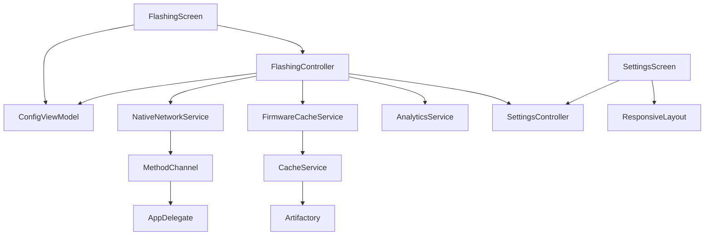

# Module & Component Breakdown

**Project**: ELRS Mobile
**Analysis Date**: 2026-03-18
**Modules Analyzed**: 6

## Core Modules

### core/networking (`lib/src/core/networking/`)
**Purpose**: Device discovery, connectivity management, HTTP client for ELRS device communication
**Complexity**: High
**Dependencies**: flutter/services, platform channels

**Key Components**:
- **NativeNetworkService**: Platform channel wrapper for WiFi binding
- **ConnectivityService**: Network state monitoring and auto-binding
- **DiscoveryService**: mDNS device discovery with fallback
- **DeviceDio**: Configured HTTP client for device API calls

**Public Interface**:
```dart
// Native binding
Future<void> bindProcessToWiFi();
Future<void> unbindProcess();

// Device discovery
Future<List<DiscoveredDevice>> discoverDevices();
Future<Device> connectToDevice(String ip);

// Device communication
Future<RuntimeConfig> getConfig(String ip);
Future<void> setConfig(String ip, RuntimeConfig config);
```

### features/flashing/presentation (`lib/src/features/flashing/presentation/`)
**Purpose**: Firmware flashing UI layer - screens, widgets, and state management
**Complexity**: High
**Dependencies**: core/networking, core/storage, core/analytics, features/settings, features/config

**Key Components**:
- **FlashingController** (`flashing_controller.dart`): State management with Freezed
- **FlashingScreen** (`flashing_screen.dart`): Main flashing UI with connection guard
- **VersionSelector** (`widgets/version_selector.dart`): Cached firmware dropdown
- **TargetSelectionCard** (`widgets/target_selection.dart`): Target picker
- **OptionsCard** (`widgets/options_card.dart`): Bind phrase and options

**Usage Examples**:
```dart
// State observation
final state = ref.watch(flashingControllerProvider);
final status = state.status;
final isConnected = configAsync.hasValue && configAsync.value != null;

// Actions
ref.read(flashingControllerProvider.notifier).startFlash();
```

**Testing**: [`test/features/flashing/`] - Controller unit tests with mocked dependencies

### features/settings/presentation (`lib/src/features/settings/presentation/`)
**Purpose**: App configuration UI with master-detail tablet layout
**Complexity**: Medium
**Dependencies**: core/presentation, sentry_flutter

**Services**:
- **SettingsController**: Global binding phrase, WiFi credentials, regulatory domains
- **SettingsScreen**: Master-detail layout with visibility toggles

**Configuration**: SharedPreferences + FlutterSecureStorage
**Error Handling**: Sentry integration for debug report submission

### website/marketing (`website/src/`)
**Purpose**: Astro-based marketing website with landing page
**Complexity**: Low
**Dependencies**: Astro Starlight, Tailwind CSS, Google Analytics

**Components**:
- Landing page with features and installation links
- SEO structured data (SoftwareApplication schema)
- Documentation via Starlight

### ios/native (`ios/Runner/`)
**Purpose**: iOS native app delegate with Flutter engine setup
**Complexity**: Low
**Dependencies**: Flutter SDK

**Responsibilities**:
- Implicit Flutter engine initialization
- Plugin registration (channel handler removed - no longer needed)

### store_front/assets (`store_front/`)
**Purpose**: Marketing assets and screenshot utilities
**Complexity**: Low
**Dependencies**: PIL/Pillow

**Components**:
- Python script for App Store screenshot scaling

## Module Dependencies

### Dependency Graph


### Import Analysis
- **Most Imported**: FlashingController (cross-feature coordination)
- **Most Dependencies**: core/networking (platform integration)
- **Circular Dependencies**: None detected

## Module Metrics

| Module | Files | Complexity | Pattern |
|--------|-------|------------|---------|
| core/networking | 4 | High | Platform Channel |
| features/flashing | 8 | High | Riverpod + Freezed |
| features/settings | 4 | Medium | Master-Detail |
| website | 12 | Low | Astro Starlight |
| ios/native | 2 | Low | Flutter Engine |
| store_front | 1 | Low | PIL Script |

## Code Quality Insights

### Well-Structured Modules
- **FlashingController**: Clean separation of concerns with Freezed immutable states
- **NativeNetworkService**: Clear platform channel abstraction with error handling

### Areas for Improvement
- **AppDelegate.swift**: Simplified (removed unused channel handler)

### Architectural Patterns
- **Feature-First Organization**: Discrete functional modules under lib/src/features/
- **Provider Composition**: Controllers read from multiple services via Riverpod
- **Platform Channel Abstraction**: Clean Dart API over native implementations
