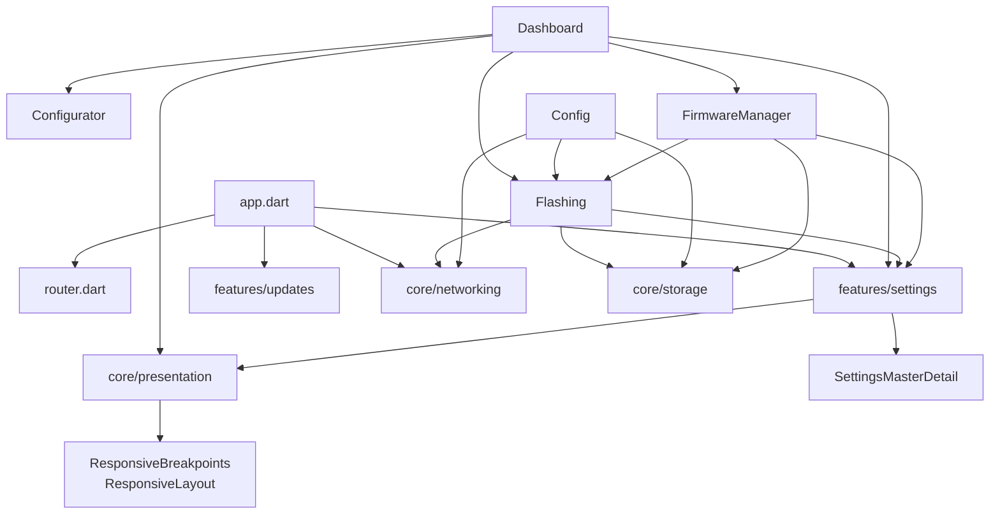

# Module & Component Breakdown

**Project**: ELRS (ExpressLRS) Mobile App
**Analysis Date**: 2026-03-12
**Modules Analyzed**: 12

## Core Modules

### core/theme (`lib/src/core/theme/`)
**Purpose**: App-wide Material 3 theming with ELRS brand colors
**Complexity**: Low
**Dependencies**: flutter

**Key Components**:
- **AppTheme** (`app_theme.dart`): Material 3 dark theme configuration

**Public Interface**:
```dart
// Exports
export 'app_theme.dart';
```

### core/presentation (`lib/src/core/presentation/`) [NEW]
**Purpose**: Shared presentation utilities - responsive breakpoint helpers for tablet/desktop layouts
**Complexity**: Low
**Dependencies**: flutter

**Key Components**:
- **ResponsiveBreakpoints** (`responsive_layout.dart`): Breakpoint constants (tablet: 600, desktop: 1200, maxContentWidth: 800)
- **ResponsiveLayout** (`responsive_layout.dart`): Widget for max-width constraint on tablets

**Public Interface**:
```dart
// Static helpers
ResponsiveLayout.isTablet(BuildContext)
ResponsiveLayout.isDesktop(BuildContext)
```

### core/storage (`lib/src/core/storage/`)
**Purpose**: Persistence layer - SharedPreferences for settings and file-based firmware caching
**Complexity**: Low
**Dependencies**: shared_preferences, path_provider, archive

**Key Components**:
- **PersistenceService**: Bind phrase, WiFi credentials, manual IP storage
- **FirmwareCacheService**: Firmware ZIP file caching, cache size management

**Public Interface**:
```dart
// Providers
persistenceServiceProvider
firmwareCacheServiceProvider
```

### core/networking (`lib/src/core/networking/`)
**Purpose**: Device discovery, connectivity management, HTTP client for ELRS device communication
**Complexity**: Medium
**Dependencies**: dio, connectivity_plus, dns_client

**Key Components**:
- **DiscoveryService**: mDNS/bonjour scanning for `_http._tcp`
- **ConnectivityService**: Network interface binding for WiFi control
- **NativeNetworkService**: Platform channel for WiFi binding (iOS/Android)
- **DeviceDio**: Pre-configured HTTP client
- **ConnectionRepository**: Target IP management

**Public Interface**:
```dart
// Providers
connectivityServiceProvider
discoveryServiceProvider
localDioProvider
githubDioProvider
artifactoryDioProvider
discoveryProvider
targetIpProvider
```

## Feature Modules

### features/flashing (`lib/src/features/flashing/`)
**Purpose**: Core firmware flashing functionality - target selection, firmware download, patching, and device flashing
**Complexity**: High
**Dependencies**: core/storage, core/networking, features/settings

**Key Components**:
- **FlashingController**: End-to-end flashing orchestration
- **FlashingScreen**: Main UI with target/options cards
- **TargetSelectionCard**: Cascading dropdowns (device type → vendor → frequency → target)
- **OptionsCard**: Bind phrase, WiFi credentials, regulatory domain inputs
- **VersionSelector**: Firmware version selection
- **FirmwarePatcher**: Binary firmware modification
- **DeviceRepository**: Device flashing via HTTP
- **FirmwareRepository**: Artifactory download/extraction
- **TargetsRepository**: Target JSON fetching
- **ReleasesRepository**: Version metadata from GitHub
- **TargetDefinition**: Freezed model for device targets
- **PatchConfiguration**: Freezed model for patching config
- **FirmwareAssembler**: UID generation from binding phrase
- **TargetResolver**: Hardware layout resolution
- **HardwareConfigMerger**: Base/overlay merging

**Testing**: 18 test files in `test/` directory

### features/dashboard (`lib/src/features/dashboard/`)
**Purpose**: Main entry screen - displays device connection status and navigation
**Complexity**: Low
**Dependencies**: features/settings, flutter_svg, core/presentation

**Key Components**:
- **DashboardScreen**: Main hub with navigation cards (adapts 2-col mobile, 3-col tablet)
- **DashboardCard**: Navigation card widget
- **HardwareStatusCard**: Device connection status
- **ConnectionStatusBadge**: Status indicator
- **UpdateNotificationBanner**: App update notification

### features/settings (`lib/src/features/settings/`)
**Purpose**: App configuration - binding phrases, WiFi credentials, developer mode
**Complexity**: Medium
**Dependencies**: core/storage, core/presentation

**Key Components**:
- **SettingsController**: Global app settings management
- **SettingsScreen**: Settings UI with master-detail on tablet
- **DisclaimerDialog**: First-launch disclaimer
- **LegalNoticeScreen** [NEW]: Legal disclaimer and GPLv3 license
- **SettingsMasterDetail** [NEW]: Master-detail layout widget

### features/config (`lib/src/features/config/`)
**Purpose**: Device runtime configuration - heartbeat monitoring, options management
**Complexity**: Medium
**Dependencies**: core/networking, core/storage, features/flashing

**Key Components**:
- **ConfigViewModel**: Heartbeat polling, config fetch/update (added ref.mounted guards)
- **DeviceConfigService**: HTTP client for device config
- **RuntimeConfigModel**: Freezed model (ElrsSettings, ElrsOptions, ElrsConfig)
- **FrequencyValidator**: Frequency validation against hardware

### features/configurator (`lib/src/features/configurator/`)
**Purpose**: Device settings UI screen
**Complexity**: Low

**Key Components**:
- **DeviceSettingsScreen**: Device configuration UI

### features/firmware_manager (`lib/src/features/firmware_manager/`)
**Purpose**: Offline firmware cache management
**Complexity**: Low
**Dependencies**: core/storage, features/flashing

**Key Components**:
- **FirmwareManagerController**: Cache lifecycle management
- **FirmwareManagerScreen**: Cache UI

### features/updates (`lib/src/features/updates/`)
**Purpose**: App update checking functionality
**Complexity**: Low

**Key Components**:
- **UpdateController**: Version checking
- **UpdateState**: Freezed state model

### features/splash (`lib/src/features/splash/`)
**Purpose**: Initial app launch splash screen
**Complexity**: Low

**Key Components**:
- **SplashScreen**: Launch screen

## Module Dependencies

### Dependency Graph


### Import Analysis
- **Most Imported**: core/networking (used by flashing, config)
- **Most Dependencies**: features/flashing (20 files, complex internal deps)
- **Circular Dependencies**: None detected

## Module Metrics

| Module | Files | Lines | Complexity | Test Coverage |
|--------|-------|-------|------------|---------------|
| features/flashing | 20 | 3,500 | High | Good |
| core/networking | 6 | 400 | Medium | N/A |
| core/storage | 2 | 249 | Low | N/A |
| core/presentation | 1 | 43 | Low | N/A |
| features/settings | 6 | 1,050 | Medium | Limited |
| features/config | 5 | 600 | Medium | Limited |
| features/dashboard | 5 | 280 | Low | Limited |
| features/firmware_manager | 2 | 300 | Low | N/A |
| features/updates | 2 | 100 | Low | N/A |
| core/theme | 1 | 68 | Low | N/A |
| features/configurator | 1 | 50 | Low | N/A |
| features/splash | 1 | 50 | Low | N/A |

## Code Quality Insights

### Well-Structured Modules
- **features/flashing**: Clear separation (data/domain/application/presentation), good test coverage
- **core/storage**: Simple, focused responsibility
- **core/networking**: Well-organized with providers for each client

### Areas for Improvement
- **Test coverage**: Limited in non-flashing features
- **Error handling**: Could benefit from custom exception types
- **Observability**: Debug print statements instead of structured logging

### Architectural Patterns
- **Clean Architecture**: Layered separation (core infrastructure vs features)
- **Riverpod State Management**: Code-generated providers with .g.dart
- **Repository Pattern**: Abstracts HTTP/storage concerns
- **Freezed Immutable States**: Immutable state classes with copyWith
- **Responsive Layout**: Core presentation module for adaptive breakpoints
- **Master-Detail**: Tablet-optimized settings navigation
