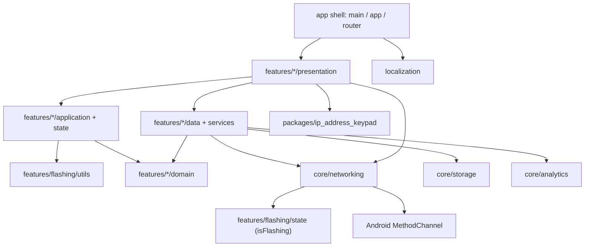

# Module & Component Breakdown

**Project**: ELRS Mobile
**Analysis Date**: 2026-08-27
**Modules Analyzed**: ~22 (feature slices + core directories + app shell + vendored package)

## Feature Modules (`lib/src/features/`)

### flashing (`features/flashing/`)
**Purpose**: the core feature — download ExpressLRS firmware, patch/assemble it for a selected target, flash it to the device over Wi-Fi. Fullest clean-architecture slice: `data` / `domain` / `application` / `utils` / `presentation` / `state`.
**Complexity**: High (~30 files, ~3.5k LOC across sub-modules).
**Key components**: `presentation/flashing_controller.dart`, `application/firmware_patcher.dart`, `utils/firmware_assembler.dart`, `utils/unified_firmware_builder.dart`, `utils/stm32_firmware_patcher.dart`, `utils/target_resolver.dart`, `utils/hardware_config_merger.dart`, `data/device_repository.dart`, `data/firmware_repository.dart`, `data/releases_repository.dart`, `data/targets_repository.dart`, `domain/target_definition.dart`, `domain/flashing_profile.dart`, `domain/patch_configuration.dart`, `state/flashing_provider.dart` (`isFlashingProvider`).
**Public API**: providers `flashingControllerProvider`, `firmwarePatcherProvider`, `targetsProvider`, `isFlashingProvider`, `deviceRepositoryProvider`, `targetsRepositoryProvider`; screen `FlashingScreen (/flashing)`; static I/O-free utils.
**Contract**: consumers interact via Riverpod providers; other modules must set `isFlashing` to suspend discovery/heartbeat during a flash.

### config (`features/config/`)
**Purpose**: live device configuration — connect to a flashed device, heartbeat/probe it, read and write runtime ELRS settings (domain, power, model mappings), frequency-safety validation.
**Complexity**: High (~13 files, ~1.2k LOC).
**Key components**: `presentation/config_view_model.dart`, `presentation/device_editor_view_model.dart`, `services/device_config_service.dart`, `domain/runtime_config_model.dart`, `domain/elrs_mappings.dart`, `utils/frequency_validator.dart`.
**Public API**: providers `configViewModelProvider`, `deviceConfigServiceProvider`; domain `RuntimeConfig`, `ElrsMappings`, `FrequencyValidator`. Depends on `core/networking` for transport.

### firmware_manager (`features/firmware_manager/`)
**Purpose**: manage the local firmware cache — list available vs cached versions, download with progress, report and clear cache size.
**Complexity**: Medium (~4 files, ~360 LOC). Reuses `ReleasesRepository` and `FirmwareCacheService`.
**Key components**: `presentation/firmware_manager_controller.dart`, `presentation/firmware_manager_screen.dart`.

### settings (`features/settings/`)
**Purpose**: app settings screen and state — app locale/language selection, disclaimer/legal acceptance, Wi-Fi-on interval, flashing profiles, Expert Mode, analytics opt-in.
**Complexity**: Medium (~8 files, ~1.6k LOC — largest single presentation surface).
**Key components**: `presentation/settings_controller.dart`, `presentation/settings_screen.dart`, `presentation/widgets/settings_master_detail.dart`, `presentation/disclaimer_dialog.dart`, `presentation/legal_notice_screen.dart`.

### dashboard (`features/dashboard/`)
**Purpose**: post-connection home screen showing device status and quick-action navigation cards.
**Complexity**: Medium (~4 files, ~670 LOC). Key: `presentation/dashboard_screen.dart`, widgets `hardware_status_card.dart`, `connection_status_badge.dart`, `dashboard_card.dart`.

### configurator (`features/configurator/`)
**Purpose**: thin presentation shell hosting the device's embedded WebUI in a locked WebView. Single file `presentation/device_settings_screen.dart` (`/device_config`).

### updates (`features/updates/`)
**Purpose**: app self-update check controller. Legacy Gist-based check is now stubbed (store distribution). Key: `presentation/update_controller.dart`, `domain/update_state.dart`.

### splash / support (`features/splash/`, `features/support/`)
**Purpose**: `splash_screen.dart` — startup route (`/`), timed hand-off to Dashboard. `support_screen.dart` — help walkthrough, FAQ, community/recovery links, localized with fallback.

## Core Modules (`lib/src/core/`)

### core/networking (`core/networking/`)
**Purpose**: device connectivity infrastructure — mDNS/NSD discovery, connectivity monitoring, target-IP state, an ESP8285-tuned sequential Dio client, native platform-channel Wi-Fi process binding.
**Complexity**: Medium (~12 files, ~630 LOC).
**Key components**: `discovery_service.dart`, `discovery_provider.dart`, `connectivity_service.dart`, `connection_repository.dart` (`TargetIp`), `device_dio.dart` (`SequentialRequestInterceptor`, `localDioProvider`), `native_network_service.dart`.
**Contract**: all device HTTP goes through `localDioProvider`; base URL comes from `TargetIp` state.

### core/storage (`core/storage/`)
**Purpose**: persistence — `SharedPreferences` + `flutter_secure_storage` wrapper with a one-time sensitive-data migration, and an on-disk firmware/hardware-zip + targets-JSON cache.
**Complexity**: Medium (~4 files, ~430 LOC). Key: `persistence_service.dart`, `firmware_cache_service.dart`.
**Contract**: single choke point for prefs/secrets and the on-disk firmware cache.

### core/utils (`core/utils/`)
**Purpose**: cross-feature helpers — `binding_phrase_utils.dart` (phrase -> UID MD5), `lua_export_utils.dart` (file-picker export), `validation_utils.dart` (SSID/password checks), `bytes_builder_extension.dart`.

### core/analytics / core/theme / core/presentation
`analytics_service.dart` — Aptabase wrapper, lazy init, silent no-op on failure. `app_theme.dart` — Material 3 dark-only theme. `responsive_layout.dart` — max-width constraint on tablet/desktop breakpoints (`ResponsiveLayout.isTablet`).

## Support Modules

### localization (`lib/l10n/*.arb`, `lib/src/localization/`)
Generated `AppLocalizations` for ~18 locales plus ARB sources; `arb_translate` (Gemini) performs machine translation in CI. Largest module by raw LOC (~7k, generated).

### App shell (`lib/`, `lib/src/`)
`main.dart` (entrypoint, Logger + Sentry breadcrumbs, `ProviderContainer`), `src/app.dart` (`UncontrolledProviderScope` + `MaterialApp.router` + lifecycle bootstrap), `src/router.dart` (go_router table for 8 routes), `src/bit_list.dart` (immutable bit view).
**Routes**: `/`, `/dashboard`, `/flashing`, `/settings`, `/device_config`, `/firmware_manager`, `/legal`, `/support`.

### packages/ip_address_keypad
Vendored local Flutter package — numeric IP-address input widget/keypad, consumed for manual device IP entry (~280 LOC).

### Non-app assets
`website/` (separate Astro marketing/docs site), `firmware_testing/` (Python `audit_tool.py` + Dart `logic_validator.dart` for byte-match verification against the Web Flasher), `scripts/` (changelog generation, markdown translation), `assets/lua/elrs.lua` (bundled Lua template).

## Key Components Reference

| Component | File | Role |
|-----------|------|------|
| `FlashingController` | `features/flashing/presentation/flashing_controller.dart` | Riverpod Notifier orchestrating the end-to-end flash pipeline and `FlashingState`; holds wakelock, silences heartbeat, detects post-upload mismatch |
| `FirmwarePatcher` | `features/flashing/application/firmware_patcher.dart` | Chooses STM32 (bit-packing) vs ESP (assembled later) path; derives UID |
| `Stm32FirmwarePatcher` | `features/flashing/utils/stm32_firmware_patcher.dart` | Static util writing 6-byte UID + `Uint8` domain into STM32 firmware via `ByteData`; bounds checks reported to Sentry |
| `FirmwareAssembler` / `UnifiedFirmwareBuilder` | `features/flashing/utils/` | Append fixed-width product-name (128 B) / lua-name (16 B) / options-JSON (512 B) / layout-JSON (2048 B) blocks to trimmed firmware |
| `TargetResolver` / `HardwareConfigMerger` | `features/flashing/utils/` | Extract base layout from `hardware.zip` (RX/TX folder heuristics), shallow-merge target overlay |
| `FirmwareRepository` | `features/flashing/data/firmware_repository.dart` | Download firmware artifacts/zips from Artifactory (Dio), unpack archives |
| `ReleasesRepository` | `features/flashing/data/releases_repository.dart` | List downloadable versions from the Artifactory index; offline/cache fallback |
| `DeviceRepository` | `features/flashing/data/device_repository.dart` | Device HTTP: `POST /update` multipart, read `hardware.json`/config, `/reboot`, `/forceupdate`; integrates assembler + analytics |
| `TargetsRepository` | `features/flashing/data/targets_repository.dart` | Fetch `targets.json` (GitHub raw), cache it, parse off-isolate via `compute`, tiered cache/asset fallback |
| `ConfigViewModel` | `features/config/presentation/config_view_model.dart` | Live device connection lifecycle: heartbeat timer, aggressive discovery poller, manual IP, probe diagnostics, `RuntimeConfig` read/write |
| `DeviceConfigService` | `features/config/services/device_config_service.dart` | Low-level device HTTP (probe, config GET/POST) with short timeouts + `CancelToken`; V3->V4 normalization |
| `FrequencyValidator` | `features/config/utils/frequency_validator.dart` | Rejects a 2.4 GHz-capable model reporting a sub-GHz frequency (`modelId` bit 7) |
| `DiscoveryService` | `core/networking/discovery_service.dart` | mDNS/NSD scanning; serialized start/stop/restart (UDP 5353 rebind guard); auto-restart on Wi-Fi transitions; skips while `isFlashing` |
| `device_dio` / `SequentialRequestInterceptor` | `core/networking/device_dio.dart` | Dio client forcing strictly sequential requests to protect the ESP8285 web server |
| `NativeNetworkService` | `core/networking/native_network_service.dart` | `MethodChannel` bridge — bind app process to a no-internet Wi-Fi network |
| `PersistenceService` | `core/storage/persistence_service.dart` | Unified prefs + secrets read/write; one-time `migrateIfNeeded()` plaintext -> secure storage; seeds a default profile |
| `FirmwareCacheService` | `core/storage/firmware_cache_service.dart` | On-disk cache of firmware/hardware archives + targets JSON; size report / clear / oldest-first eviction |
| `BindingPhraseUtils` | `core/utils/binding_phrase_utils.dart` | `generateUid(phrase)` — ELRS `phrase.js` algorithm (literal prefix + MD5, first 6 bytes) |
| `SettingsController` | `features/settings/presentation/settings_controller.dart` | App-level settings state (`appLocale`, disclaimer, Wi-Fi-on interval, profiles); `loadSettings` at startup |
| `goRouter` | `lib/src/router.dart` | go_router route table for the 8 top-level screens |

## Module Dependencies

```mermaid
graph TD
    Shell["app shell: main / app / router"] --> FeatPres["features/*/presentation"]
    FeatPres --> FeatApp["features/*/application + state"]
    FeatPres --> FeatData["features/*/data + services"]
    FeatApp --> FeatUtils["features/flashing/utils"]
    FeatApp --> FeatDomain["features/*/domain"]
    FeatData --> FeatDomain
    FeatData --> CoreNet["core/networking"]
    FeatData --> CoreStore["core/storage"]
    FeatData --> CoreAnalytics["core/analytics"]
    FeatPres --> CoreNet
    CoreNet --> FlashState["features/flashing/state (isFlashing)"]
    CoreNet --> Native["Android MethodChannel"]
    Shell --> L10n["localization"]
    FeatPres --> Keypad["packages/ip_address_keypad"]
```

### Import analysis
- **Most depended-on**: `core/networking` (`localDioProvider`, `TargetIp`, `discoveryService`) and `core/storage` (`FirmwareCacheService`, `PersistenceService`).
- **Most dependencies**: `FlashingController` — wires firmware patcher, firmware/device/targets repositories, cache, settings, config view model, connectivity, analytics.
- **Circular / cross-layer edge**: `core/networking/discovery_service.dart` -> `features/flashing/state/flashing_provider.dart` (core depends on a feature — architectural smell, kept intentionally for the flash mutex).

## Module Metrics (approx., generated files excluded)

| Module | Files | LOC | Complexity |
|--------|-------|-----|------------|
| features/flashing/presentation | 7 | 2,060 | High |
| features/settings/presentation | 8 | 1,630 | Medium |
| features/config | 13 | 1,180 | High |
| features/flashing/data | 10 | 830 | Medium |
| features/dashboard/presentation | 4 | 670 | Medium |
| core/networking | 12 | 630 | Medium |
| features/flashing/utils | 5 | 480 | High (bit-level) |
| core/storage | 4 | 430 | Medium |
| features/firmware_manager | 4 | 360 | Medium |
| packages/ip_address_keypad | 1 | 280 | Low |
| lib/src (app shell) | 6 | 250 | Low |
| features/configurator | 1 | 143 | Low |
| core/utils | 4 | 110 | Low |
| localization (generated) | 18 | 7,170 | Low |

## Code Quality Insights

### Well-structured
- **features/flashing** — clean layer separation; firmware manipulation is pure, static, I/O-free and unit-testable in isolation; heavy parsing offloaded via `compute()`.
- **core/storage** — single choke point for persistence with an explicit secret-hardening migration.
- **core/networking** — one shared serialized Dio implementation for all device calls.

### Areas for improvement
- **Cross-layer dependency**: `core/networking` -> `features/flashing/state`. A neutral `core`-level `isFlashing` flag would remove the inversion.
- **Test coverage**: a single widget test (`test/localization_overflow_test.dart`) covering localization overflow across all supported locales; no unit tests for repositories, services, or the firmware assembler (the highest-risk code). `firmware_testing/` scripts exist but are out-of-process audit tools, not CI unit tests.
- **Two overlapping ESP builders**: `firmware_assembler.dart` and `unified_firmware_builder.dart` implement similar fixed-width block assembly — candidates for consolidation.
- **`settings_screen.dart` size** (~1.6k LOC) — the largest single file; extracting per-category widgets would help.

## Related KB Links

- Layer model and data flows: [architecture.md](architecture.md)
- Domain models these modules operate on: [concept_map.md](concept_map.md)
- Conventions used across modules: [patterns.md](patterns.md)
