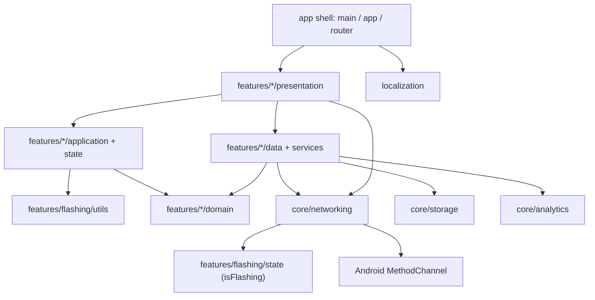

# Module & Component Breakdown

**Project**: ELRS Mobile
**Analysis Date**: 2026-09-22
**Modules Analyzed**: ~20 (feature slices + core directories + app shell)

## Feature Modules (`lib/src/features/`)

### flashing (`features/flashing/`)
**Purpose**: the core feature — download ExpressLRS firmware, patch/assemble it for a selected target, flash it to the device over Wi-Fi. Fullest clean-architecture slice: `data` / `domain` / `application` / `utils` / `presentation` / `state`.
**Complexity**: High (~27 files, ~3.3k LOC across sub-modules).
**Key components**: `presentation/flashing_controller.dart`, `application/firmware_patcher.dart`, `utils/firmware_assembler.dart`, `utils/stm32_firmware_patcher.dart`, `utils/target_resolver.dart`, `utils/hardware_config_merger.dart`, `data/device_repository.dart`, `data/firmware_repository.dart`, `data/releases_repository.dart`, `data/targets_repository.dart`, `domain/target_definition.dart`, `domain/flashing_profile.dart`, `domain/patch_configuration.dart`, `state/flashing_provider.dart` (`isFlashingProvider`).
**Public API**: providers `flashingControllerProvider`, `firmwarePatcherProvider`, `targetsProvider`, `isFlashingProvider`, `deviceRepositoryProvider`, `targetsRepositoryProvider`; screen `FlashingScreen (/flashing)`; static I/O-free utils.
**Contract**: consumers interact via Riverpod providers; other modules must set `isFlashing` to suspend discovery/heartbeat during a flash.
**Recent changes**: `ReleasesRepository` raised the minimum offered firmware version from `>= 3.0.0` to `>= 3.3.0` (pre-3.3.0 firmware lacks unified-build support). `FlashingController`'s target-mismatch force-flash now calls `confirmForceUpdate()` directly first (the mismatched bytes are still in the device's OTA buffer from the initial `/update`), falling back to a full re-upload-then-confirm only if that fails — cuts a redundant network round trip on the common force-flash path. `utils/unified_firmware_builder.dart` (superseded, divergent duplicate of `firmware_assembler.dart`) and three unused barrel `index.dart` re-exports (`data/`, `application/`, `presentation/`) were deleted as dead code. `FlashingController.FlashingStatus` expanded from `{idle, downloading, patching, uploading, success, downloadSuccess, error, mismatch}` to `{idle, locating, unpacking, downloading, building, uploading, finalizing, success, downloadSuccess, error, mismatch}` so the progress bar reflects real phases: `locating`/`unpacking` cover the normal offline cache-read path, `downloading` is now only the rare network-fallback, and a new `finalizing` phase (indeterminate progress bar) covers the post-upload device write/reboot window that has no progress signal of its own. `DeviceRepository.flashFirmware`'s `onSendProgress` callback — previously accepted, documented, and silently never invoked — is now actually forwarded, fixing a real bug where the upload progress bar never moved.

### config (`features/config/`)
**Purpose**: live device configuration — connect to a flashed device, heartbeat/probe it, read and write runtime ELRS settings (domain, power, model mappings), frequency-safety validation.
**Complexity**: High (~11 files, ~1.0k LOC).
**Key components**: `presentation/config_view_model.dart` (now the module's only view-model), `services/device_config_service.dart`, `domain/runtime_config_model.dart`, `domain/elrs_mappings.dart`, `utils/frequency_validator.dart`.
**Public API**: providers `configViewModelProvider`, `deviceConfigServiceProvider`; domain `RuntimeConfig`, `ElrsMappings` (now a single `domains900` constant). Depends on `core/networking` for transport.
**Recent changes**: `DeviceConfigService` gained a legacy-firmware compatibility layer — `probeDeviceHead` falls back to the universal `probeDevice('/')` when `/hardware.json` (3.2.x+ only) fails, and `fetchConfig` falls back to a new `_fetchLegacyConfig()` that reconstructs a `RuntimeConfig` from `/target` + best-effort `/mode.json` when `/config` (3.1.0+) 404s. This lets the app read/identify devices on firmware as old as ~3.0.x even though flashing/downloads remain gated to `>= 3.3.0`. `presentation/device_editor_view_model.dart` (a native device-config editor) was deleted as dead code — superseded by the embedded device WebUI in `features/configurator`. `ConfigViewModel` lost `updateWifiSsid`/`updateWifiPassword`/`updateOption`/`_saveOptions`/`reboot` (dead, unwired to any UI); `DeviceConfigService` lost `saveOptions`/`saveConfig`/`reboot` as a cascade once `ConfigViewModel.reboot` (their only caller) was removed. `elrs_mappings.dart` was trimmed from six lookup maps to the one still-used `domains900` constant.

### firmware_manager (`features/firmware_manager/`)
**Purpose**: manage the local firmware cache — list available vs cached versions, download with progress, report and clear cache size.
**Complexity**: Medium (~4 files, ~360 LOC). Reuses `ReleasesRepository` and `FirmwareCacheService`.
**Key components**: `presentation/firmware_manager_controller.dart`, `presentation/firmware_manager_screen.dart`.

### settings (`features/settings/`)
**Purpose**: app settings screen and state — app locale/language selection, disclaimer/legal acceptance, Wi-Fi-on interval, flashing profiles, Expert Mode, analytics opt-in.
**Complexity**: Medium (~8 files, ~1.6k LOC — largest single presentation surface).
**Key components**: `presentation/settings_controller.dart`, `presentation/settings_screen.dart`, `presentation/widgets/settings_master_detail.dart`, `presentation/disclaimer_dialog.dart`, `presentation/legal_notice_screen.dart`.
**Recent changes**: `settings_screen.dart` added Norwegian Bokmål (`nb`/`no` -> "Norsk") to the language dialog list and dropdown.

### dashboard (`features/dashboard/`)
**Purpose**: post-connection home screen showing device status and quick-action navigation cards.
**Complexity**: Medium (~3 files, ~600 LOC). Key: `presentation/dashboard_screen.dart`, widgets `hardware_status_card.dart`, `dashboard_card.dart`.
**Recent changes**: `widgets/connection_status_badge.dart` deleted as dead code — superseded by the live `discoveryServiceProvider` (`core/networking/discovery_service.dart`).

### configurator (`features/configurator/`)
**Purpose**: thin presentation shell hosting the device's embedded WebUI in a locked WebView. Single file `presentation/device_settings_screen.dart` (`/device_config`). Now the sole device-configuration-editing surface since `config`'s native `DeviceEditorViewModel` was removed.

### updates (`features/updates/`) — REMOVED
Formerly the app self-update-check controller (legacy Gist-based check, already stubbed for store distribution). `presentation/update_controller.dart`(`.g.dart`) and `domain/update_state.dart`(`.freezed.dart`) were deleted outright — the app now relies entirely on Google Play / App Store distribution with no in-app update-checking code path.

### splash / support (`features/splash/`, `features/support/`)
**Purpose**: `splash_screen.dart` — startup route (`/`), timed hand-off to Dashboard; disclaimer text now reads "Compatible with 3.3.x/4.x firmware" (was "3.x/4.x"), matching the `ReleasesRepository` minimum-version bump. `support_screen.dart` — help walkthrough, FAQ, community/recovery links, localized with fallback (new `assets/docs/app_faq_nb.md`).

## Core Modules (`lib/src/core/`)

### core/networking (`core/networking/`)
**Purpose**: device connectivity infrastructure — mDNS/NSD discovery, connectivity monitoring, target-IP state, an ESP8285-tuned sequential Dio client, native platform-channel Wi-Fi process binding.
**Complexity**: Medium (~11 files, ~630 LOC).
**Key components**: `discovery_service.dart` (`discoveryServiceProvider` — sole discovery entry point), `expected_reboot_drop.dart` (`isExpectedRebootSocketDrop`), `connectivity_service.dart`, `connection_repository.dart` (`TargetIp`), `device_dio.dart` (`SequentialRequestInterceptor`, `localDioProvider`), `native_network_service.dart`.
**Contract**: all device HTTP goes through `localDioProvider`; base URL comes from `TargetIp` state.
**Recent changes**: `discovery_provider.dart`(`.g.dart`) deleted as dead code — it duplicated `discovery_service.dart`'s Wi-Fi-transition scan logic but was never watched by anything; `discoveryServiceProvider` was always the live path. New shared `expected_reboot_drop.dart` added: a single canonical `isExpectedRebootSocketDrop(DioException)` predicate replacing two independently-diverged copies that used to live inline in `DeviceRepository` and `DeviceConfigService` (the diverged copies disagreed on whether `ECONNREFUSED` counted as an expected reboot, causing some successful flashes to be reported as failures).

### core/storage (`core/storage/`)
**Purpose**: persistence — `SharedPreferences` + `flutter_secure_storage` wrapper with a one-time sensitive-data migration, and an on-disk firmware/hardware-zip + targets-JSON cache.
**Complexity**: Medium (~4 files, ~430 LOC). Key: `persistence_service.dart`, `firmware_cache_service.dart`.
**Contract**: single choke point for prefs/secrets and the on-disk firmware cache.
**Recent changes**: `flutter_secure_storage` bumped `^9.2.2` -> `^10.3.4` (start of a cipher migration per commit e2401d5); `persistence_service.dart`'s secure-storage init dropped the explicit `AndroidOptions(encryptedSharedPreferences: true)` in favor of v10's `AndroidOptions()` defaults. The Apple-platform plugin was also renamed `flutter_secure_storage_macos` -> `flutter_secure_storage_darwin` (see `macos/Flutter/GeneratedPluginRegistrant.swift`).

### core/utils (`core/utils/`)
**Purpose**: cross-feature helpers — `binding_phrase_utils.dart` (phrase -> UID MD5), `lua_export_utils.dart` (file-picker export), `validation_utils.dart` (SSID/password checks).
**Recent changes**: `bytes_builder_extension.dart` (`BytesBuilderExtension`) deleted as dead code — no remaining callers.

### core/analytics / core/theme / core/presentation
`analytics_service.dart` — Aptabase wrapper, lazy init, silent no-op on failure. `app_theme.dart` — Material 3 dark-only theme. `responsive_layout.dart` — max-width constraint on a tablet breakpoint (`ResponsiveLayout.isTablet`); the unused `isDesktop`/desktop-breakpoint pair was deleted as dead code.

## Support Modules

### localization (`lib/l10n/*.arb`, `lib/src/localization/`)
Generated `AppLocalizations` for 18 locales plus ARB sources; `arb_translate` (Gemini) performs machine translation in CI. Largest module by raw LOC (~7k, generated). Norwegian Bokmål (`nb`) added: new `app_nb.arb`, `AppLocalizationsNb` delegate registered in `app_localizations.dart`, and a Norwegian FAQ asset (`assets/docs/app_faq_nb.md`).

### App shell (`lib/`, `lib/src/`)
`main.dart` (entrypoint, Logger + Sentry breadcrumbs, `ProviderContainer`), `src/app.dart` (`UncontrolledProviderScope` + `MaterialApp.router` + lifecycle bootstrap), `src/router.dart` (go_router table for 8 routes).
**Routes**: `/`, `/dashboard`, `/flashing`, `/settings`, `/device_config`, `/firmware_manager`, `/legal`, `/support`.
**Recent changes**: `src/bit_list.dart` (`BitList`, immutable bit view) deleted as dead code — no remaining callers.

### packages/ip_address_keypad — REMOVED
Formerly a vendored local Flutter package for numeric IP-address input. Deleted as dead weight: it was never wired into the root `pubspec.yaml` (no `path:`/`dependency_overrides` entry), and the vendored `lib/` had no `ip_address_keypad.dart` entrypoint to satisfy the import anyway — the app has always actually consumed the pub.dev-published `ip_address_keypad` package of the same name.

### Non-app assets
`website/` (separate Astro marketing/docs site — hero subtitle and supported-hardware doc across all locales now state a "3.3.x/4.x" firmware floor, matching the app), `firmware_testing/` (Python `audit_tool.py` + Dart `logic_validator.dart` for byte-match verification against the Web Flasher), `scripts/` (changelog generation, markdown translation), `assets/lua/elrs.lua` (bundled Lua template). `website/scripts/translate_astro.cjs`'s doc translator now merges a guide's title + body into one Gemini request instead of two, roughly halving API calls for that path; the whole translation pipeline (`arb_translate` + `scripts/translate_markdown.js` + `translate_astro.cjs`, all Gemini 2.5 Flash) is manually triggered by pushing to a dedicated `translations` branch — never CI-auto-run — to keep API spend under direct control. A stray 65MB release APK and several stale `digest*.txt` LLM-context dumps were untracked from git and added to `.gitignore`.

### platform_shells (`android/`, `ios/`, `macos/` native glue)
Android `MainActivity.kt`, iOS `AppDelegate.swift`/`SceneDelegate.swift`, macOS `GeneratedPluginRegistrant.swift`. Android build tooling bumped to Gradle 9.3.1 with the modern `kotlin { compilerOptions { jvmTarget } }` DSL (migrated off deprecated `kotlinOptions`); macOS registrant regenerated for the `flutter_secure_storage_darwin` plugin rename. Release pipeline (`.github/workflows/release.yml`) unified onto a single `v*`-tag/`workflow_dispatch`-triggered workflow (was split across a development-branch push trigger and a separate RC workflow).

## Key Components Reference

| Component | File | Role |
|-----------|------|------|
| `FlashingController` | `features/flashing/presentation/flashing_controller.dart` | Riverpod Notifier orchestrating the end-to-end flash pipeline and `FlashingState`; holds wakelock, silences heartbeat, detects post-upload mismatch; force-flash now confirms the buffered OTA payload directly before falling back to re-upload |
| `FirmwarePatcher` | `features/flashing/application/firmware_patcher.dart` | Chooses STM32 (bit-packing) vs ESP (assembled later) path; derives UID |
| `Stm32FirmwarePatcher` | `features/flashing/utils/stm32_firmware_patcher.dart` | Static util writing 6-byte UID + `Uint8` domain into STM32 firmware via `ByteData`; bounds checks reported to Sentry |
| `FirmwareAssembler` | `features/flashing/utils/firmware_assembler.dart` | Append fixed-width product-name (128 B) / lua-name (16 B) / options-JSON (512 B) / layout-JSON (2048 B) blocks to trimmed firmware — now the sole ESP builder; the divergent duplicate `unified_firmware_builder.dart` was deleted |
| `TargetResolver` / `HardwareConfigMerger` | `features/flashing/utils/` | Extract base layout from `hardware.zip` (RX/TX folder heuristics), shallow-merge target overlay |
| `FirmwareRepository` | `features/flashing/data/firmware_repository.dart` | Download firmware artifacts/zips from Artifactory (Dio), unpack archives |
| `ReleasesRepository` | `features/flashing/data/releases_repository.dart` | List downloadable versions from the Artifactory index (now filtered to `>= 3.3.0`); offline/cache fallback |
| `DeviceRepository` | `features/flashing/data/device_repository.dart` | Device HTTP: `POST /update` multipart, `/forceupdate`; builds/uploads firmware via `FirmwareAssembler`; classifies post-reboot socket drops via `isExpectedRebootSocketDrop`. No longer analytics-integrated and no longer reads config/hardware.json/wifi/binding-phrase endpoints (those dead methods were removed with the cleanup pass) |
| `isExpectedRebootSocketDrop` | `core/networking/expected_reboot_drop.dart` | Pure predicate classifying a `DioException` as an expected hardware-reboot socket drop (`ECONNABORTED`/`ECONNRESET`/`EPIPE`/`ECONNREFUSED`-style matches); sole shared implementation, replacing two previously-diverged private copies |
| `TargetsRepository` | `features/flashing/data/targets_repository.dart` | Fetch `targets.json` (GitHub raw), cache it, parse off-isolate via `compute`, tiered cache/asset fallback |
| `ConfigViewModel` | `features/config/presentation/config_view_model.dart` | Live device connection lifecycle: heartbeat timer, aggressive discovery poller, manual IP, probe diagnostics, `RuntimeConfig` read/write |
| `DeviceConfigService` | `features/config/services/device_config_service.dart` | Low-level device HTTP (probe, config GET/POST) with short timeouts + `CancelToken`; V3->V4 normalization; legacy-firmware fallback (`/target`+`/mode.json`) for pre-3.1.0 devices |
| `FrequencyValidator` | `features/config/utils/frequency_validator.dart` | Rejects a 2.4 GHz-capable model reporting a sub-GHz frequency (`modelId` bit 7) |
| `DiscoveryService` | `core/networking/discovery_service.dart` | mDNS/NSD scanning; serialized start/stop/restart (UDP 5353 rebind guard); auto-restart on Wi-Fi transitions; skips while `isFlashing` |
| `device_dio` / `SequentialRequestInterceptor` | `core/networking/device_dio.dart` | Dio client forcing strictly sequential requests to protect the ESP8285 web server |
| `NativeNetworkService` | `core/networking/native_network_service.dart` | `MethodChannel` bridge — bind app process to a no-internet Wi-Fi network |
| `PersistenceService` | `core/storage/persistence_service.dart` | Unified prefs + secrets read/write; one-time `migrateIfNeeded()` plaintext -> secure storage; seeds a default profile |
| `FirmwareCacheService` | `core/storage/firmware_cache_service.dart` | On-disk cache of firmware/hardware archives + targets JSON; size report / clear / oldest-first eviction |
| `BindingPhraseUtils` | `core/utils/binding_phrase_utils.dart` | `generateUid(phrase)` — ELRS `phrase.js` algorithm (literal prefix + MD5, first 6 bytes) |
| `SettingsController` | `features/settings/presentation/settings_controller.dart` | App-level settings state (`appLocale`, disclaimer, Wi-Fi-on interval, profiles); `loadSettings` at startup |
| `goRouter` | `lib/src/router.dart` | go_router route table for the 8 top-level screens |

## Module Dependencies

```mermaid
graph TD
    Shell["app shell: main / app / router"] --> FeatPres["features/*/presentation"]
    FeatPres --> FeatApp["features/*/application + state"]
    FeatPres --> FeatData["features/*/data + services"]
    FeatApp --> FeatUtils["features/flashing/utils"]
    FeatApp --> FeatDomain["features/*/domain"]
    FeatData --> FeatDomain
    FeatData --> CoreNet["core/networking"]
    FeatData --> CoreStore["core/storage"]
    FeatData --> CoreAnalytics["core/analytics"]
    FeatPres --> CoreNet
    CoreNet --> FlashState["features/flashing/state (isFlashing)"]
    CoreNet --> Native["Android MethodChannel"]
    Shell --> L10n["localization"]
```

### Import analysis
- **Most depended-on**: `core/networking` (`localDioProvider`, `TargetIp`, `discoveryService`) and `core/storage` (`FirmwareCacheService`, `PersistenceService`).
- **Most dependencies**: `FlashingController` — wires firmware patcher, firmware/device/targets repositories, cache, settings, config view model, connectivity, analytics.
- **Circular / cross-layer edge**: `core/networking/discovery_service.dart` -> `features/flashing/state/flashing_provider.dart` (core depends on a feature — architectural smell, kept intentionally for the flash mutex).

## Module Metrics (approx., generated files excluded)

| Module | Files | LOC | Complexity |
|--------|-------|-----|------------|
| features/flashing/presentation | 7 | 2,090 | High |
| features/settings/presentation | 8 | 1,620 | Medium |
| features/config | 11 | 1,000 | High |
| features/flashing/data | 10 | 810 | Medium |
| features/dashboard/presentation | 3 | 600 | Medium |
| core/networking | 11 | 610 | Medium |
| features/flashing/utils | 4 | 400 | High (bit-level) |
| core/storage | 4 | 420 | Medium |
| features/firmware_manager | 4 | 360 | Medium |
| lib/src (app shell) | 5 | 220 | Low |
| features/configurator | 1 | 143 | Low |
| core/utils | 3 | 85 | Low |
| localization (generated) | 18 | 7,170 | Low |

## Code Quality Insights

### Well-structured
- **features/flashing** — clean layer separation; firmware manipulation is pure, static, I/O-free and unit-testable in isolation; heavy parsing offloaded via `compute()`.
- **core/storage** — single choke point for persistence with an explicit secret-hardening migration.
- **core/networking** — one shared serialized Dio implementation for all device calls; reboot-socket-drop classification is now a single shared predicate (`expected_reboot_drop.dart`) instead of two diverged copies.

### Areas for improvement
- **Cross-layer dependency**: `core/networking` -> `features/flashing/state`. A neutral `core`-level `isFlashing` flag would remove the inversion.
- **Test coverage**: a single widget test (`test/localization_overflow_test.dart`) covering localization overflow across all supported locales; no unit tests for repositories, services, or the firmware assembler (the highest-risk code). `firmware_testing/` scripts exist but are out-of-process audit tools, not CI unit tests.
- **`settings_screen.dart` size** (~1.6k LOC) — the largest single file; extracting per-category widgets would help.

### Resolved this cycle
- **Two overlapping ESP builders** — `unified_firmware_builder.dart` (a divergent, less-correct duplicate of `firmware_assembler.dart`'s firmware-trimming logic) was deleted; `FirmwareAssembler` is now the sole ESP builder.
- **Dead-code sweep**: a full-codebase audit + cleanup pass removed the entire `features/updates/` module, `DeviceEditorViewModel`, `ConnectionStatusBadge`, `discovery_provider.dart`, three unused barrel `index.dart` files, the unwired vendored `packages/ip_address_keypad/`, and numerous dead methods across `device_repository.dart`, `config_view_model.dart`, `device_config_service.dart`, `elrs_mappings.dart`, `persistence_service.dart`, `settings_controller.dart`, and `responsive_layout.dart` — roughly 1,150 lines net. Treat this as one coordinated event; some removals (e.g. `DeviceConfigService.reboot`) were cascades triggered only after their sole caller was independently found dead.

## Related KB Links

- Layer model and data flows: [architecture.md](architecture.md)
- Domain models these modules operate on: [concept_map.md](concept_map.md)
- Conventions used across modules: [patterns.md](patterns.md)
